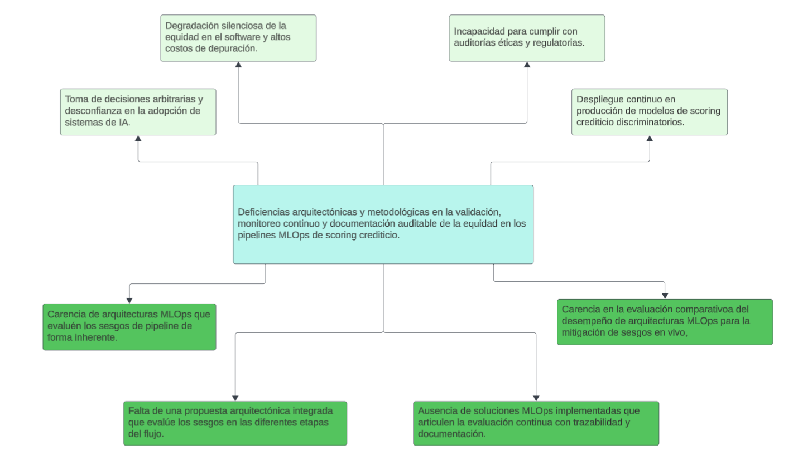

<!-- Fuente: 20202117_SergioChumbimuni_LuisVives_E2.pdf, pp. 4–20. Transcripción del PDF con correcciones editoriales y rediseño del producto (ver capitulos/CAMBIOS.md); ver capitulos/README.md -->

# Capítulo 1. Generalidades

## 1.1 Problemática

### 1.1.1 Descripción

En el ecosistema financiero internacional, las instituciones de tecnología financiera (*Fintech*) y la banca global emplean de manera generalizada algoritmos de aprendizaje automático (*Machine Learning - ML*) para automatizar el otorgamiento de créditos y evaluar la solvencia de los solicitantes (Byanjankar et al., 2015; Immaneni, 2020). Si bien este enfoque reduce los costos operativos y optimiza los tiempos de respuesta, los modelos predictivos absorben y perpetúan de manera silenciosa los sesgos sociales e históricos presentes en los datos de entrenamiento (Ghai et al., 2022; Caballar & Stryker, 2024). El gran riesgo es la generación de exclusión financiera y discriminación injustificada contra subgrupos vulnerables al calificar su comportamiento crediticio. Evidencia empírica reciente en la era Fintech demuestra que, aunque el uso de algoritmos de *lending* automatizados puede reducir la discriminación en aproximadamente un 40% en comparación con los prestamistas humanos tradicionales al eliminar prejuicios cara a cara, el sesgo algorítmico y la discriminación por proxy persisten de forma sistemática (Bartlett et al., 2022).

Un problema crítico en el desarrollo de estos sistemas es que la discriminación no surge únicamente del conjunto de datos inicial, sino que puede inyectarse y amplificarse de manera silenciosa durante las etapas intermedias de preparación de datos, como la limpieza, normalización o imputación de valores faltantes (Biswas & Rajan, 2021). En la práctica operativa actual, los análisis de equidad se realizan únicamente al final del ciclo de desarrollo sobre el modelo ya entrenado, tratándolo como una "caja negra" (Nguyen, 2024). Esta falta de verificación modular impide a los desarrolladores y científicos de datos identificar en qué punto específico de la canalización de software se originó la desviación, obligando a los equipos a realizar costosos, lentos y propensos a error procesos de depuración manual.

Asimismo, la confiabilidad de los clasificadores de riesgo disminuye drásticamente tras su despliegue debido a que el comportamiento demográfico y macroeconómico del mercado real cambia constantemente en comparación con el entorno estático con el que fueron entrenados (Nigenda et al., 2022). Sin una supervisión constante, estas variaciones provocan que un algoritmo que se consideraba justo y preciso durante su desarrollo comience a generar resultados discriminatorios inadvertidos al operar con datos en vivo (Avuthu, 2021; Caballar & Stryker, 2024).

Esta necesidad técnica ha cobrado un carácter de urgencia legal a nivel internacional. El Reglamento (UE) 2024/1689 (Ley de IA de la Unión Europea - EU AI Act) clasifica de manera estricta a los sistemas de IA utilizados para evaluar la solvencia o la calificación crediticia de personas naturales como sistemas de riesgo alto (Anexo III, punto 5.b) (Reglamento IA UE, 2024). En el Perú, el Reglamento de la Ley N.° 31814, aprobado por el Decreto Supremo N.° 115-2025-PCM, adopta el mismo criterio al considerar de riesgo alto el uso de sistemas de IA para "determinar la evaluación crediticia de personas" (art. 24.1, literal g) (Presidencia del Consejo de Ministros [PCM], 2025). Asimismo, en los Estados Unidos, regulaciones como la *Equal Credit Opportunity Act* (ECOA) prohíben de forma contundente la discriminación crediticia basándose en atributos protegidos como el género, la raza o la edad (ECOA, 1974). Estos marcos internacionales imponen a los desarrolladores e implementadores obligaciones imperativas de control de calidad, mitigación preventiva de sesgos y el mantenimiento de un registro de trazabilidad automático de las fuentes de datos y la lógica de los algoritmos para facilitar auditorías externas (Reglamento IA UE, 2024).

La ausencia de metodologías integradas que automaticen la verificación de equidad etapa por etapa en el ciclo de vida del software y que generen documentación auditable sobre las decisiones del modelo impide que las Fintech operen de forma competitiva a escala global mientras cumplen simultáneamente con los estándares éticos y las exigencias de fiscalización de los reguladores financieros más estrictos del mundo.

### 1.1.2 Árbol de problemas

En la Figura 1 se presenta el árbol de problemas de la presente investigación, en el cual se representa de manera esquemática la relación entre las causas que originan la problemática identificada en los flujos de calificación crediticia automática.

**Figura 1: Árbol de problemas**

> **Nota de transcripción (texto contenido en la figura):**
> - Problema central: "Deficiencias arquitectónicas y metodológicas en la validación, monitoreo continuo y documentación auditable de la equidad en los pipelines MLOps de scoring crediticio."
> - Efectos: "Toma de decisiones arbitrarias y desconfianza en la adopción de sistemas de IA." · "Degradación silenciosa de la equidad en el software y altos costos de depuración." · "Incapacidad para cumplir con auditorías éticas y regulatorias." · "Despliegue continuo en producción de modelos de scoring crediticio discriminatorios."
> - Causas: "Carencia de arquitecturas MLOps que evaluén los sesgos de pipeline de forma inherente." · "Falta de una propuesta arquitectónica integrada que evalúe los sesgos en las diferentes etapas del flujo." · "Ausencia de soluciones MLOps implementadas que articulen la evaluación continua con trazabilidad y documentación." · "Carencia en la evaluación comparativoa del desempeño de arquitecturas MLOps para la mitigación de sesgos en vivo,"

- **Canal de Causalidad 1 (Pre-desarrollo - Análisis de la Literatura):** La carencia de arquitecturas MLOps que evalúen los sesgos de la canalización de *Machine Learning* de forma inherente conduce a la toma de decisiones arbitrarias e injustificables para los solicitantes de crédito, limitando la confianza en la adopción de estos sistemas. Al no contar con flujos de trabajo automatizados que incorporen consideraciones éticas desde su raíz, la selección de modelos se reduce a criterios de exactitud, ignorando asimetrías de impacto en atributos protegidos. Este canal justifica el Objetivo Específico O1 (Analizar), orientado a identificar las brechas y capacidades de gobernanza ética en las arquitecturas MLOps existentes.
- **Canal de Causalidad 2 (Diseño Arquitectónico Modular - Etapas del Pipeline):** La falta de una propuesta arquitectónica MLOps integrada que evalúe de forma continua y modular los sesgos introducidos en las diferentes etapas del *pipeline* de *Machine Learning* —incluyendo la ingesta, el preprocesamiento, el entrenamiento y el monitoreo— genera una degradación silenciosa de la equidad del software y elevados costos operativos para diagnosticar y localizar la causa raíz de la discriminación en el código. Al tratarse el *pipeline* como un bloque monolítico, los sesgos por proxy se propagan sin control en las fases intermedias de transformación. Este canal justifica el Objetivo Específico O2 (Diseñar), orientado a establecer un esquema arquitectónico modular que localice y controle preventivamente el sesgo etapa por etapa.
- **Canal de Causalidad 3 (Flujo CI/CD - Implementación del Prototipo):** La ausencia de soluciones MLOps implementadas que articulen herramientas y metodologías orientadas a la evaluación continua de sesgos con la trazabilidad y la documentación auditable de las decisiones algorítmicas resulta en la incapacidad de la Fintech para cumplir con auditorías éticas, de gobernanza y regulatorias internacionales severas (como el EU AI Act o la ECOA estadounidense) debido a la opacidad y la falta de evidencias técnicas estructuradas. Al no integrar el control ético de calidad con repositorios de metadatos, se mantiene una dependencia de procesos manuales lentos e inconsistentes. Este canal justifica el Objetivo Específico O3 (Desarrollar), cuyo propósito es instrumentar un prototipo automatizado que integre controles de equidad con una capa semántica para la trazabilidad.
- **Canal de Causalidad 4 (Monitoreo - Evaluación Comparativa):** La carencia en la evaluación comparativa del desempeño de arquitecturas MLOps orientadas a la mitigación y evaluación continua de sesgos ante escenarios dinámicos del mundo real origina el despliegue involuntario y la persistencia en producción de modelos de *scoring* crediticio discriminatorios que perpetúan sesgos históricos y daños sistémicos de exclusión financiera contra subgrupos vulnerables. Al no validar experimentalmente la resiliencia del sistema frente a perturbaciones o derivas de datos, el *pipeline* permanece vulnerable. Este canal justifica el Objetivo Específico O4 (Evaluar), orientado a contrastar empíricamente la efectividad de la arquitectura bajo pruebas de estrés de forma sistémica.

### 1.1.3 Problema seleccionado

El problema central seleccionado consiste en las deficiencias metodológicas y de infraestructura para la validación, el monitoreo continuo y la documentación auditable de la equidad algorítmica dentro de los *pipelines* MLOps de *scoring* crediticio a nivel global. Este problema radica en que los flujos de trabajo actuales de aprendizaje automático separan el despliegue técnico del aseguramiento de la calidad ética, concentrando el análisis en la etapa final en lugar de extenderlo a todo el ciclo de vida de los datos y del modelo (Stoyanovich et al., 2022). Al no evaluar la equidad de forma continua e integrada en el ciclo de vida del software, las canalizaciones corren el riesgo de sufrir degradaciones silenciosas donde las transformaciones de datos intermedias o los cambios del entorno en producción introducen discriminación contra subgrupos vulnerables sin generar alertas técnicas (Biswas & Rajan, 2021).

## 1.2 Objetivos

### 1.2.1 Objetivo General

Implementar una arquitectura MLOps de Nivel 2 orientada a la validación continua de equidad (*fairness*) como prueba de aseguramiento de calidad (QA) automatizada y auditable para modelos predictivos supervisados de *scoring* crediticio, demostrando su viabilidad técnica, eficacia en la mitigación de riesgos éticos y adaptabilidad operativa en el contexto global de desarrollo de software confiable.

### 1.2.2 Objetivos específicos

- **O1:** Analizar el estado del arte y las brechas tecnológicas en las arquitecturas MLOps existentes que abordan el aseguramiento de equidad e integración de controles continuos en el desarrollo de software.
- **O2:** Diseñar el esquema de la arquitectura MLOps que integre compuertas de calidad (*QA Gates*) modulares, gobernadas por contratos de equidad declarativos, y un modelo semántico para garantizar la trazabilidad ética en todas las etapas del *pipeline* de *scoring* crediticio.
- **O3:** Implementar el prototipo funcional de la arquitectura integrando herramientas de automatización CI/CD, un motor de contratos de validación de equidad evaluados en tiempo de compilación y el registro semántico del linaje en un grafo de conocimiento.
- **O4:** Evaluar la efectividad de la arquitectura MLOps propuesta en un entorno de simulación, utilizando un conjunto de datos de *scoring* crediticio reportado como proveniente de una Fintech de Asia Central y datos públicos de solicitudes de crédito hipotecario de Estados Unidos, mediante pruebas de estrés con inyección sintética de sesgos y derivas de datos.

### 1.2.3 Resultados esperados

A continuación, se detallan los 3 resultados esperados correspondientes a cada objetivo específico:

**Para el Objetivo Específico 1 (Análisis de Arquitecturas MLOps existentes):**

- **R.E.1.1:** Un documento de revisión de la literatura que recopile y filtre las arquitecturas y marcos de trabajo MLOps actuales orientados a la validación de equidad en modelos predictivos.
- **R.E.1.2:** Una matriz de análisis comparativo que evalúe las arquitecturas existentes en términos de sus capacidades de automatización, integración continua, monitoreo y trazabilidad documental.
- **R.E.1.3:** Un informe de brechas tecnológicas que identifique las limitaciones operativas de las soluciones actuales para fundamentar y justificar el diseño de la nueva propuesta arquitectónica.

**Para el Objetivo Específico 2 (Diseño de la arquitectura MLOps proactiva):**

- **R.E.2.1:** Un esquema arquitectónico detallado (C4 hasta el nivel 3) que defina la solución bajo un patrón de *Pipeline* por Etapas (Integración y Entrega Continua) y una capa superior Orientada al Conocimiento para la trazabilidad, estableciendo la ubicación exacta de las compuertas de calidad a lo largo de la canalización.
- **R.E.2.2:** Una especificación de diseño de los componentes modulares de validación de equidad, que incluya el esquema declarativo común de los contratos y la formulación de las reglas que se evaluarán de forma preventiva en las fases críticas donde se genera el sesgo.
- **R.E.2.3:** Un modelo conceptual de trazabilidad diseñado para capturar y estructurar los metadatos del sistema, permitiendo registrar el linaje de los datos y las métricas de equidad para su posterior auditoría.

**Para el Objetivo Específico 3 (Implementación de la arquitectura MLOps propuesta):**

- **R.E.3.1:** Un entorno de integración continua automatizado y configurado, con versionado de datos y un motor de contratos que ejecute de forma automática las compuertas de calidad del *pipeline* de aprendizaje automático.
- **R.E.3.2:** Los módulos de validación de equidad programados e integrados en la canalización, utilizando aserciones evaluadas en tiempo de compilación. Estos módulos tendrán la capacidad técnica de interrumpir automáticamente el flujo del orquestador, o de activar la remediación declarada en el contrato, cuando un componente viole los contratos de equidad establecidos.
- **R.E.3.3:** Un servicio de monitoreo y registro implementado, capaz de recopilar información de las predicciones y del ciclo de vida del modelo para detectar desviaciones en el tiempo, generar las razones de rechazo y facilitar la exportación de reportes.

**Para el Objetivo Específico 4 (Evaluación de la efectividad frente a enfoques tradicionales):**

- **R.E.4.1:** Escenarios de prueba de estrés mediante la inyección sintética de sesgos y derivas en el conjunto de datos de *scoring* crediticio, incluido un escenario de control sin inyección.
- **R.E.4.2:** Resultados analíticos comparativos de rendimiento técnico (tasa de detección, precisión de localización, etapa de detección, tiempo hasta el bloqueo y tasa de falsos positivos) frente a enfoques tradicionales.
- **R.E.4.3:** Informe final con consultas semánticas SPARQL y el reporte de cumplimiento PDF autogenerado desde el Grafo de Trazabilidad.

### 1.2.4 Mapeo de objetivos, resultados y verificación

A continuación, se presenta la matriz de trazabilidad que vincula cada objetivo específico con sus respectivos resultados esperados, estableciendo los medios de verificación tangibles y los indicadores objetivamente verificables que certificarán el cumplimiento de las metas del proyecto a lo largo de su ciclo de desarrollo.

| Resultado Esperado | Medio de verificación | Indicador objetivamente verificable |
|---|---|---|
| **R.E.1.1:** Un documento de revisión de la literatura que recopile y filtre las arquitecturas y marcos de trabajo *MLOps* actuales orientados a la validación de equidad en modelos predictivos. | Capítulo 3 del documento de tesis (Estado del Arte). | Revisión sistemática completada utilizando el diagrama de flujo PRISMA con al menos 20 estudios primarios seleccionados. |
| **R.E.1.2:** Una matriz de análisis comparativo que evalúe las arquitecturas existentes en términos de sus capacidades de automatización, integración continua, monitoreo y trazabilidad documental. | Formulario de extracción (incluida en los Anexos). | Matriz completada que evalúa el 100% de los estudios seleccionados bajo los criterios metodológicos y tecnológicos de *MLOps* |
| **R.E.1.3:** Un informe de brechas tecnológicas que identifique las limitaciones operativas de las soluciones actuales para fundamentar y justificar el diseño de la nueva propuesta. | Sección de "Conclusiones del Estado del Arte" en el informe. | Identificación y justificación documentada de al menos tres (3) limitaciones operativas o arquitectónicas en los enfoques actuales. |

**Tabla 1.** Resultados esperados, medios de verificación e indicadores objetivamente verificables para el objetivo específico 1.

| Resultado Esperado | Medio de verificación | Indicador objetivamente verificable |
|---|---|---|
| **R.E.2.1:** Un esquema arquitectónico detallado que defina las distintas capas del ciclo de vida del modelo y establezca la ubicación exacta de las compuertas de calidad. | Diagramas de contexto, contenedores y componentes basados en el Modelo C4. | Presentación de diagramas que identifiquen explícitamente las cuatro (4) zonas del pipeline, la capa de persistencia semántica, el flujo de integración continua y la ubicación estratégica de las compuertas de calidad (QA Gates). |
| **R.E.2.2:** Especificación técnica y formulación de reglas, umbrales y aserciones de equidad en las diferentes etapas de la canalización de software. | Documento de especificación de diseño técnico y esquema declarativo de los contratos. | Formulación matemática explícita de las reglas, aserciones y umbrales tolerables de equidad e integridad de datos para las compuertas de calidad (QA Gates) del pipeline. |
| **R.E.2.3:** Modelo conceptual de metadatos de trazabilidad diseñado para estructurar el linaje y las métricas de sesgo. | Esquema de la ontología (Turtle) y formas de validación (SHACL). | Modelo conceptual estructurado que interconecte las entidades de datos, modelo, métricas de sesgo y resultados de ejecución, validable mediante restricciones formales. |

**Tabla 2.** Resultados esperados, medios de verificación e indicadores objetivamente verificables para el objetivo específico 2.

| Resultado Esperado | Medio de verificación | Indicador objetivamente verificable |
|---|---|---|
| **R.E.3.1:** Un entorno de integración continua (*CI*) automatizado y configurado, con versionado de datos y un motor de contratos que ejecute las compuertas de calidad. | Repositorio privado de código fuente con pipelines de *CI* configurados y contratos YAML versionados. | Ejecución exitosa y automatizada del pipeline base, en local y en el servidor de integración, sin errores de compilación o empaquetado. |
| **R.E.3.2:** Módulos de validación y control de equidad integrados en la canalización con capacidad de interrupción y remediación. | Código fuente y bitácora de ejecución de las compuertas de calidad. | Interrupción automatizada e inmediata de la canalización (salida con código de error), o remediación registrada, cuando un componente viole los umbrales de equidad establecidos. |
| **R.E.3.3:** Servicio de monitoreo continuo de deriva y registro de metadatos de experimentos implementado. | Registros de MLflow, bitácoras de ejecución y reportes de monitoreo. | Registro automático y persistente de los metadatos de entrenamiento, predicciones por lote, razones de rechazo y alertas de deriva ética generados en el ciclo de vida. |

**Tabla 3.** Resultados esperados, medios de verificación e indicadores objetivamente verificables para el objetivo específico 3.

| Resultado Esperado | Medio de verificación | Indicador objetivamente verificable |
|---|---|---|
| **R.E.4.1:** Escenarios de validación experimental mediante la inyección sistemática de sesgos y anomalías de datos en scoring crediticio. | Scripts de inyección de distorsiones y conjuntos de datos de prueba. | Simulación documentada de al menos cinco (5) escenarios de inyección que apliquen perturbaciones estructurales en los datos, los transformadores, las etiquetas o los lotes de producción, más un (1) escenario de control sin inyección. |
| **R.E.4.2:** Resultados cuantitativos comparativos de desempeño de calidad y eficiencia técnica frente a enfoques tradicionales. | Tablas y gráficos comparativos de desempeño técnico. | Demostración empírica de la mejora en tasa de detección, precisión de localización del sesgo, etapa de detección y tiempo hasta el bloqueo frente al Nivel 0 de MLOps, reportando la tasa de falsos positivos del escenario de control. |
| **R.E.4.3:** Informe final de evaluación y reporte de cumplimiento semántico automatizado. | Informe técnico de auditoría. | Consulta y recuperación exitosa de metadatos en el grafo de conocimiento para responder las preguntas de competencia de la ontología y generar el informe automatizado de cumplimiento normativo. |

**Tabla 4.** Resultados esperados, medios de verificación e indicadores objetivamente verificables para el objetivo específico 4.

## 1.3 Métodos y Procedimientos

En esta sección se describen los métodos, herramientas y procedimientos que se emplearán para alcanzar los resultados esperados de esta investigación. La elección de cada componente tecnológico y metodológico se fundamenta en las prácticas modernas de la Ingeniería de Software para Inteligencia Artificial y la literatura reciente sobre MLOps y gobernanza algorítmica (Kazmierczak et al., 2024; Russo et al., 2024).

| Resultado Esperado | Herramientas | Métodos y procedimientos |
|---|---|---|
| **R.E.1.1 a R.E.1.3** (Revisión de literatura, matriz y brechas tecnológicas) | - Motores de Búsqueda (*Scopus, IEEE Xplore, Google Scholar*) - Zotero - Google Sheets | - Revisión Sistemática de la Literatura basada en la metodología PICOC y el diagrama de flujo PRISMA. - Análisis comparativo de arquitecturas. |
| **R.E.2.1 a R.E.2.3** (Esquema arquitectónico, diseño de *QA Gates* y modelo de trazabilidad semántica) | - LucidChart - Especificaciones RDF/OWL - Vocabularios PROV-O y DQV - SHACL | - Modelado arquitectónico de software utilizando el estándar del Modelo C4. - Diseño lógico-conceptual de Contratos de Equidad modulares (precondiciones y postcondiciones) en un esquema declarativo común. - Modelado conceptual de la Ontología de Fairness (Noy & McGuinness, 2001) reutilizando vocabularios del W3C. |
| **R.E.3.1 a R.E.3.3** (Entorno *CI*, validación de equidad automatizada y monitoreo) | - Python (pandas y scikit-learn) - Pytest - GitHub Actions (CI/CD) - MLflow - Fairlearn - Pandera - DVC - Evidently AI - SHAP | - Implementación de canalizaciones MLOps de Nivel 2 (CI/CD/CT) reproducibles en local y en integración continua. - Programación de un motor de contratos que ejecuta las compuertas de calidad (*QA Gates*) definidas de forma declarativa (YAML), con capacidad de interrupción (exit 1 en Pytest) y remediación. - Instrumentación del registro de linaje, del monitoreo de derivas (*bias drift*) y de la generación de razones de rechazo (SHAP). |
| **R.E.4.1 a R.E.4.3** (Escenarios de prueba, resultados comparativos e informe final) | - Pytest - RDFLib - pySHACL - Oxigraph (GraphDB opcional) - SPARQL | - Pruebas de estrés inyectando sesgos y derivas en los datos. - Validación experimental frente al Nivel 0 y evaluación de métricas de equidad. - Redacción del informe de auditoría. |

**Tabla 5.** Mapeo de resultados esperados con herramientas, métodos y procedimientos.

### 1.3.1 Herramientas

A continuación, se describen y justifican las herramientas, bibliotecas y plataformas seleccionadas para la investigación, en concordancia con los requerimientos técnicos de la arquitectura MLOps, el aseguramiento de la calidad y la gobernanza algorítmica:

- **Motores de Búsqueda (Scopus, IEEE Xplore, Google Scholar):** Se utilizaron como las principales bases de datos para la ejecución de la revisión sistemática de la literatura. Scopus e IEEE Xplore representan los repositorios de mayor impacto en los campos de ingeniería de software y ciencias de la computación, indispensables para la recuperación de estándares técnicos sobre MLOps. Por su parte, Google Scholar sirvió como motor complementario para capturar literatura gris y estudios recientes de alto valor empírico.
- **Zotero:** Gestor bibliográfico de software libre que se empleó durante la fase de recopilación del estado del arte. Su uso permitió almacenar los metadatos de los estudios primarios, organizar las referencias bajo el estándar APA y automatizar la eliminación de documentos duplicados durante la fase de cribado del diagrama PRISMA.
- **Google Sheets:** Herramienta de hojas de cálculo basada en la nube que se utilizó para el diseño y la gestión del formulario de extracción de datos. Facilitó la consolidación del formulario de extracción (Anexo A) de las arquitecturas MLOps, permitiendo organizar las brechas, los enfoques y las métricas de manera colaborativa y estructurada.
- **Lucidchart:** Plataforma de diagramación basada en la web que se empleará para el diseño conceptual y formal de la arquitectura de software. Su uso es esencial para elaborar los esquemas de flujo y los diagramas de componentes, permitiendo comunicar visualmente la ubicación estratégica de las compuertas de calidad dentro del ciclo de vida del *Machine Learning*.
- **Especificaciones RDF, PROV-O, DQV y SHACL:** Estándares del World Wide Web Consortium (W3C) para el modelado semántico de la información. RDF proporciona el modelo de tripletas del Grafo de Conocimiento; PROV-O, el vocabulario para describir el linaje de datos, modelos y actividades (Lebo et al., 2013); DQV, el vocabulario para describir mediciones de calidad, que en esta arquitectura representan las métricas de equidad (Albertoni & Isaac, 2016); y SHACL, el lenguaje para validar que cada registro del grafo cumpla las restricciones de la ontología (Knublauch & Kontokostas, 2017).
- **Python (pandas y scikit-learn):** Python será el lenguaje de programación base debido a su predominio y soporte en la ingeniería de IA. Se utilizará la biblioteca pandas para la manipulación y el preprocesamiento de los conjuntos de datos tabulares, mientras que scikit-learn se empleará para la construcción de los *pipelines* de aprendizaje automático y la implementación de los estimadores y transformadores de datos.
- **Pandera:** Biblioteca de Python para la validación declarativa de datos tabulares basada en esquemas. Permite definir contratos de datos que especifican los tipos, rangos, restricciones y reglas personalizadas que debe cumplir un DataFrame de pandas, y lanza excepciones tipadas cuando alguna columna o valor viola el esquema definido. En esta arquitectura se usa en la Zona 1 como motor de las aserciones de esquema del Contrato C1.
- **GitHub Actions (CI/CD):** Plataforma de automatización que actuará como el motor principal para habilitar las operaciones de Integración y Entrega Continua (CI/CD) sobre un repositorio privado. Permitirá orquestar los flujos de trabajo para ejecutar de manera automática el *pipeline* de *Machine Learning* y las compuertas de calidad cada vez que se detecten cambios en el código fuente, en los contratos o en los datos del repositorio.
- **DVC (Data Version Control):** Herramienta de código abierto diseñada para el versionado y la gestión de datos y modelos en proyectos de aprendizaje automático, funcionando como una extensión de Git para artefactos de gran tamaño. En la arquitectura se integrará en la Zona 1, con un almacenamiento remoto privado, para versionar cada lote de datos mediante un identificador *hash* reproducible. Esto garantiza que cada ejecución del *pipeline* pueda vincularse a una versión exacta del *dataset* de entrada, proporcionando el linaje de datos necesario para el Grafo de Conocimiento de la Zona 4.
- **Evidently AI:** Biblioteca de código abierto orientada al monitoreo y la evaluación de modelos de aprendizaje automático. En la arquitectura se empleará en la Zona 3 como motor de detección de deriva de datos (*data drift*), comparando la distribución de cada lote de producción con la de entrenamiento. La deriva del sesgo (*bias drift*) se evalúa con el Contrato C4, que recalcula las métricas de equidad sobre cada lote.
- **MLflow:** Plataforma de código abierto para la gestión del ciclo de vida del aprendizaje automático, orientada al registro de experimentos, la reproducibilidad y el despliegue de modelos (Zaharia et al., 2018). En la arquitectura actúa como el canal de linaje: registra los parámetros, el *hash* de cada lote, cada ejecución de compuerta con sus métricas e intervalos de confianza, los modelos base y remediados, las razones de rechazo y las alertas de deriva.
- **Fairlearn:** Proyecto de código abierto para evaluar y mejorar la equidad de sistemas de IA, cuya biblioteca de Python permite evaluar el comportamiento de un modelo entre poblaciones afectadas e incluye algoritmos de mitigación (Weerts et al., 2023). Proveerá el cálculo de las métricas de equidad por grupo (paridad demográfica, igualdad de oportunidades, impacto dispar) y el post-procesamiento `ThresholdOptimizer` empleado en la remediación del Contrato C3 (Hardt et al., 2016).
- **RDFLib:** Biblioteca nativa de Python para la creación, manipulación y serialización de datos en formato RDF. En la arquitectura actúa como el puente entre el *pipeline* de MLOps y el Grafo de Conocimiento de la Zona 4: transforma los metadatos registrados en MLflow en tripletas conformes a la Ontología de Fairness.
- **pySHACL y Oxigraph:** pySHACL valida el grafo exportado contra las formas SHACL de la ontología antes de incorporarlo al repositorio. Oxigraph (o el almacén en memoria de RDFLib) actúa como repositorio RDF local con soporte de consultas SPARQL; GraphDB se mantiene como alternativa opcional para la exploración visual del grafo.
- **SHAP (SHapley Additive exPlanations):** Biblioteca de Python basada en la teoría de valores de Shapley, que permite calcular la contribución individual de cada característica de entrada a la predicción de un modelo. En la arquitectura se utilizará en la Zona 3 para generar, para cada solicitante rechazado, las razones específicas del rechazo a partir de las características con mayor contribución negativa, en línea con la obligación de comunicar dichas razones establecida por la ECOA (ECOA, 1974).
- **Pytest:** Framework de pruebas para Python. El motor de contratos generará con Pytest una prueba por cada regla y atributo protegido definidos en los contratos YAML. Al integrarse con GitHub Actions, Pytest será responsable de evaluar las condiciones de equidad en tiempo de compilación e interrumpir el despliegue del modelo si los sesgos superan los umbrales tolerados.

### 1.3.2 Metodologías y Procedimientos

Para desarrollar, implementar y evaluar la arquitectura MLOps propuesta, se emplea una metodología de investigación aplicada y diseño de software, estructurada de manera secuencial a lo largo de las siguientes cinco (5) fases operativas:

- **Fase 1: Revisión Sistemática de la Literatura (O1):** El Estado del Arte de esta investigación se construirá aplicando de manera rigurosa la estrategia de búsqueda PICOC y el diagrama de flujo PRISMA, garantizando un proceso estructurado, transparente y reproducible para la selección de la literatura primaria. Esta fase permitirá identificar y fundamentar las brechas operativas en la automatización de controles de equidad dentro de la industria de tecnología financiera (Fintech).
- **Fase 2: Diseño Arquitectónico y Formulación de Contratos (O2):** Consiste en el diseño formal de la solución. Primero, se modelará la arquitectura modular en cuatro zonas operativas utilizando el Modelo C4 (Contexto, Contenedores y Componentes). Segundo, se aplicará el paradigma de Diseño por Contrato (DbC) para formular de forma matemática las precondiciones, postcondiciones e invariantes (Contratos C1 a C4, expresados en un esquema YAML común) correspondientes a las cuatro compuertas de calidad (*QA Gates*) (Nguyen, 2024). Tercero, se diseñará la Ontología de Fairness aplicando la metodología de ingeniería ontológica de Noy y McGuinness (2001), reutilizando los vocabularios PROV-O y DQV para conectar lógicamente los lotes de datos, los contratos, las métricas de equidad y los modelos (Russo et al., 2024).
- **Fase 3: Desarrollo e Implementación del Prototipo MLOps (O3):** Involucra la materialización técnica del diseño. Se construirá la canalización automatizada en Python, entrenando un clasificador supervisado base (regresión logística). Se implementará el motor de contratos, se integrará DVC para el versionado de los datos, MLflow para el registro del linaje y Pytest para la interrupción automática y la remediación ante fallos en los contratos.
- **Fase 4: Trazabilidad Semántica (O3, continuación):** Consiste en programar el exportador que transforma los registros de MLflow (ejecuciones de las compuertas, métricas, modelos y razones de rechazo) en tripletas RDF mediante RDFLib, validarlas con SHACL y persistirlas en un repositorio RDF local, garantizando el linaje de datos de extremo a extremo (Russo & Vidal, 2025).
- **Fase 5: Validación Experimental mediante Pruebas de Estrés (O4):** Representa la fase de validación científica del software. Se simularán escenarios controlados de subrepresentación, sesgo por proxy en los transformadores, sesgo en las etiquetas y deriva en los lotes de producción, además de un escenario de control sin inyección, sobre el conjunto de datos principal; y se evaluará la deriva real entre años con el conjunto de datos secundario (Zhu et al., 2025). Se medirá la tasa de detección, la precisión de localización, la etapa de detección, el tiempo hasta el bloqueo y la tasa de falsos positivos frente a una auditoría única del modelo final (Nivel 0 de MLOps). Se verificará que el Auditor pueda generar reportes PDF de cumplimiento automáticos ejecutando consultas SPARQL sobre el grafo de conocimiento.
