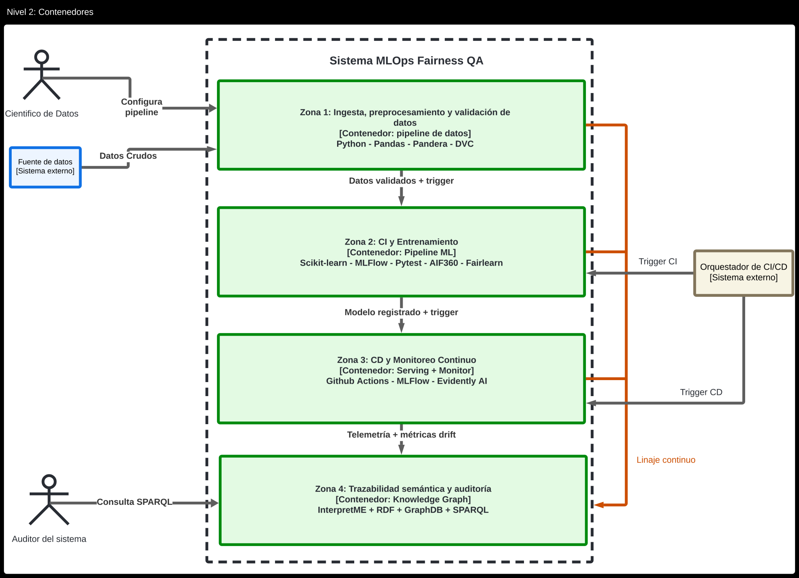
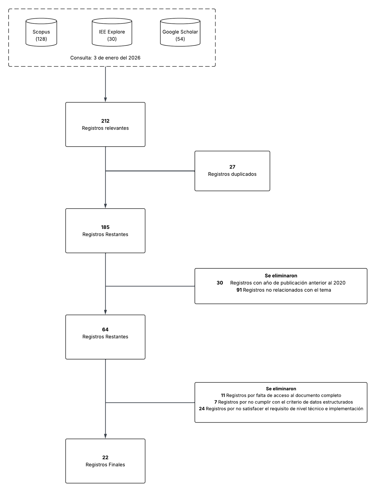

<!-- Fuente: 20202117_SergioChumbimuni_LuisVives_E2.pdf, pp. 33–52. Transcripción del PDF con correcciones editoriales (ver capitulos/CAMBIOS.md); ver capitulos/README.md -->

# Capítulo 3. Estado del Arte

## 3.1 Introducción

El presente capítulo tiene como objetivo revisar y analizar la literatura científica reciente sobre la implementación de la validación de equidad dentro del ciclo de vida del aprendizaje automático. Para estructurar adecuadamente este estado del arte, la introducción se divide en tres enfoques fundamentales: la conceptualización de MLOps como estándar de la industria, las problemáticas previamente abordadas por la comunidad científica, y los vacíos específicos que la presente investigación buscará resolver en el marco de la calidad de software.

Es fundamental definir el concepto de MLOps (*Machine Learning Operations*). MLOps es una práctica y cultura de la ingeniería que busca unificar el desarrollo y las operaciones de los sistemas de aprendizaje automático, con el objetivo de abogar por la automatización y la supervisión en todos los pasos de la construcción del sistema. En el entorno empresarial, la adopción de MLOps es indispensable para transitar de procesos de validación puramente manuales y aislados —conocidos como Nivel 0 de MLOps— hacia canalizaciones (*pipelines*) robustas que garanticen la Integración Continua (CI), Entrega Continua (CD) y Entrenamiento Continuo (CT) (Kazmierczak et al., 2024; Reda et al., 2025).

En los últimos años, la investigación del estado del arte en MLOps ha abordado extensamente la gestión del ciclo de vida de los modelos, la reproducibilidad y el despliegue a gran escala mediante el uso de plataformas infraestructurales. Sin embargo, la literatura reciente advierte que gran parte de la investigación debe volcarse a mitigar los "errores de distribución de datos", los cuales introducen sesgos técnicos y discriminación de manera silenciosa durante las etapas tempranas de preprocesamiento (Grafberger et al., 2022). Además, se ha evidenciado el desafío de evaluar las canalizaciones como una "caja negra" monolítica, destacando la necesidad de analizar la equidad de forma modular para identificar exactamente qué etapa o componente inyecta el sesgo en el modelo (Biswas & Rajan, 2021). Para mitigar estos riesgos, diversas investigaciones han propuesto herramientas de depuración de datos y métricas de equidad; no obstante, la mayoría de los enfoques actuales siguen concibiendo el cumplimiento ético como auditorías manuales externas o pruebas tardías previas al despliegue, en lugar de intervenciones proactivas y oportunas para evitar la amplificación del sesgo (Vasquez et al., 2024).

A partir de las limitaciones identificadas en la literatura, esta investigación solucionará las deficiencias metodológicas y arquitectónicas en la integración de la validación continua de equidad como una prueba de aseguramiento de calidad intrínseca, automatizada y auditable dentro del ciclo de vida de MLOps. A diferencia de los enfoques que dependen de validaciones estáticas, este trabajo abordará el problema de diseñar una arquitectura proactiva que implemente compuertas de calidad capaces de interrumpir la canalización de integración continua y bloquear de forma preventiva el despliegue de modelos sesgados (Schelter et al., 2023; Zhu et al., 2025). Adicionalmente, la investigación enfrentará la actual falta de trazabilidad semántica en las herramientas MLOps tradicionales, proponiendo el uso de grafos de conocimiento y ontologías para generar artefactos documentados estandarizados (Russo & Vidal, 2025; Russo et al., 2024). Esta infraestructura documental y de calidad es hoy un requisito indispensable para mitigar riesgos éticos y facilitar el cumplimiento de marcos globales de Gestión de Riesgos de Modelos (Caballar & Stryker, 2024), respondiendo así a las nuevas normativas internacionales, como la Ley de Inteligencia Artificial de la Unión Europea (AI Act), que exige niveles apropiados de robustez, resiliencia y documentación continua para sistemas de IA de alto riesgo (Reglamento IA UE, 2024; Zhu et al., 2025).

## 3.2 Objetivos de revisión

El objetivo de esta revisión sistemática es identificar, analizar y comparar las arquitecturas y marcos de trabajo MLOps más relevantes aplicados a la validación continua de equidad en modelos predictivos supervisados. La revisión se orienta a sintetizar la evidencia empírica disponible sobre las estrategias de integración continua, los mecanismos de control de calidad temprana y la trazabilidad documental, con el fin de detectar las limitaciones de los enfoques tradicionales y fundamentar técnica y metodológicamente la propuesta arquitectónica de esta investigación. Para alcanzar este propósito general, se plantean los siguientes objetivos específicos de revisión:

- Revisar los procesos tradicionales de validación de modelos de aprendizaje automático, identificando sus ineficiencias y limitaciones estructurales para la detección proactiva de sesgos algorítmicos.
- Examinar las arquitecturas y patrones de diseño MLOps actuales que incorporan la evaluación de equidad de manera modular, evaluando su impacto en la automatización frente a los enfoques de "caja negra".
- Analizar la implementación de compuertas de calidad y marcos de pruebas de estrés automatizados dentro de la canalización de integración continua orientados a bloquear el despliegue de modelos sesgados.
- Identificar las herramientas de monitoreo continuo y trazabilidad semántica (basadas en grafos de conocimiento u ontologías) utilizadas en la literatura para registrar el ciclo de vida del modelo y generar documentación auditable orientada al cumplimiento normativo.

**Figura 2: Arquitectura del sistema (Nivel 2 de Diagrama C4)**

> **Nota de transcripción:** esta figura es una versión del diagrama de contenedores distinta a la Figura 5 del Capítulo 4 (aquí no aparece el "Canal de Linaje — MLflow"; el linaje se dibuja como una línea "Linaje continuo" desde las Zonas 1–3 hacia la Zona 4). Texto de la figura: Zona 1 "Python - Pandas - Pandera - DVC"; Zona 2 "Scikit-learn - MLFlow - Pytest - AIF360 - Fairlearn"; Zona 3 "Github Actions - MLFlow - Evidently AI"; Zona 4 "InterpretME + RDF + GraphDB + SPARQL".

## 3.3 Preguntas de revisión

Como medida para estructurar el planteamiento de la revisión sistemática, se presenta a continuación el conjunto de preguntas que guiarán la investigación. La formulación de estas preguntas se deriva directamente del objetivo de revisión planteado en la sección anterior.

Para asegurar una estructura clara y delimitar con precisión el alcance de la búsqueda bibliográfica, la formulación se ha guiado por los criterios del marco PICOC (Petticrew & Roberts, 2006) y se puede observar en la Tabla 6.

| Metodología | Descripción |
|---|---|
| **Población** | Modelos de Aprendizaje Supervisado en entornos de producción y flujos de trabajo MLOps. |
| **Intervención** | La implementación de arquitecturas o herramientas de validación continua de equidad automatizada dentro del pipeline de MLOps. |
| **Comparación** | Los métodos de auditoría tradicionales. |
| **Resultado** | La efectividad, medida en términos de capacidad de detección de sesgos, automatización del proceso de calidad y mitigación de riesgos éticos antes y después del despliegue. |
| **Contexto** | En el ámbito del desarrollo de software y ciencia de datos, aplicable a organizaciones que despliegan modelos de IA, con énfasis en sectores regulados o de impacto social. |

**Tabla 6** Criterios Generales PICOC

De este modo, a partir de los resultados de la Tabla 6 se plantean las siguientes preguntas de revisión:

1. ¿Qué problemas o ineficiencias clave enfrentan los procesos tradicionales de validación de modelos (auditorías manuales o desconectadas del flujo de desarrollo) en la detección de sesgos en Machine Learning?
2. ¿Qué arquitecturas, herramientas y patrones de diseño MLOps existen actualmente para la validación de equidad, y cómo facilitan la detección proactiva y la evaluación modular frente a los enfoques tradicionales de "caja negra"?
3. ¿Qué mecanismos de control de calidad (QA Gates) y monitoreo continuo se implementan en las arquitecturas MLOps para bloquear el despliegue de modelos sesgados y mitigar la deriva de sesgo (*bias drift*) en producción?
4. ¿Qué desafíos técnicos y de interoperabilidad presentan las herramientas de validación de equidad para integrarse en pipelines MLOps empresariales, y cómo abordan la trazabilidad semántica para la generación de documentación auditable?

## 3.4 Protocolo de búsqueda

El protocolo de búsqueda a seguir plantea la identificación y selección sistemática de documentos (artículos de conferencia y revistas científicas) que estén relacionados con el estado actual de las arquitecturas para la validación de equidad en flujos de trabajo de Machine Learning (MLOps).

Para construir las cadenas de búsqueda, se utilizaron los términos y conceptos clave definidos en el marco PICOC (Petticrew & Roberts, 2006) de la sección anterior. Este método permitió desglosar el problema en sus componentes principales (Población, Intervención, Comparación, Outcome) para derivar sinónimos y términos de búsqueda relevantes en idioma inglés y español, asegurando una cobertura amplia de la literatura técnica y científica.

El proceso se detalla en las siguientes sub-secciones, describiendo los motores de búsqueda seleccionados por su relevancia académica y las cadenas de búsqueda específicas empleadas para cada uno.

### 3.4.1 Motores de búsqueda

Para la elección de los motores de búsqueda, se selecciona un subconjunto de bases de datos como medio para optar por la documentación necesaria durante el proceso de revisión sistemática. Las bases de datos elegidas fueron:

- **Scopus** (https://www.scopus.com): Se selecciona esta base de datos por ser uno de los mayores repositorios multidisciplinarios de resúmenes y citas de literatura científica revisada por pares. Su relevancia radica en que indexa una gran cantidad de conferencias y revistas de alto impacto, permitiendo una visión global del estado del arte.
- **IEEE Xplore** (https://ieeexplore.ieee.org): Se incluye esta biblioteca digital por ser la fuente más prestigiosa en los campos de ingeniería eléctrica, ciencias de la computación y electrónica. Dado que el enfoque de la tesis es la arquitectura de software (MLOps), esta base es crítica para encontrar estándares técnicos y estudios de implementación recientes.
- **Google Académico** (https://scholar.google.com/): Se utilizará como un motor de búsqueda complementario. Su amplio índice es útil para capturar "literatura gris" (como reportes técnicos o pre-prints) y estudios en español que podrían no estar indexados en las bases de alto impacto.

### 3.4.2 Cadenas de búsqueda a usar

A partir del marco PICOC (Petticrew & Roberts, 2006) definido en la sección anterior, se tomaron en cuenta los componentes de la investigación para seleccionar los términos clave en español e inglés. Esto aborda la necesidad de un proceso explícito para derivar los términos de búsqueda, tal como se muestra en la Tabla 7.

| Metodología | Palabras clave en español | Palabras clave en inglés |
|---|---|---|
| **Población** | "Operaciones de Aprendizaje de Máquina", "Aprendizaje Supervisado", "flujo MLOps" | "Machine Learning operations", "MLOps", "Supervised Learning", "MLOps pipeline" |
| **Intervención** | "Validación de equidad", "Detección de sesgos", "Auditoría algorítmica" | "Fairness validation", "Bias detection", "Algorithmic auditing", "performance evaluation" |
| **Comparación** | "Validación manual", "Pruebas tradicionales" | "Manual validation", "Traditional testing" |
| **Resultado** | "Mitigación de sesgos", "IA confiable", "Calidad de software" | "Bias mitigation", "Trustworthy AI", "Software Quality Assurance" |
| **Contexto** | "Ingeniería de software", "Sistemas en producción" | "Software Engineering", "Production systems" |

**Tabla 7** Cadenas de búsqueda

Para la revisión de literatura se aplicó una ecuación general de búsqueda construida a partir del marco PICOC, adaptándola a cada base de datos, las cuales se muestran en la Tabla 8. Se utilizaron términos en inglés (predominantes en el área tecnológica) y en español para ampliar los resultados y asegurar la inclusión de artículos relevantes, dejando como resultado un total de 128 resultados en la base de datos de Scopus, 30 en IEEE Xplore y 54 en la base de datos de Google Académico.

Asimismo, se desarrollaron diferentes ecuaciones de búsqueda (Tabla 8) dependiendo de cada base de datos, ya que en principio cada una de estas cumple con lo obtenido luego de la metodología PICOC. No obstante, debido a la naturaleza técnica del tema, el uso de términos en inglés influye enormemente en la obtención de resultados relevantes.

| Base de datos | Palabras / Ecuación de búsqueda |
|---|---|
| **Scopus** | `( TITLE-ABS-KEY ( "MLOps" OR "Machine Learning Operations" OR "ML pipeline" OR "CD4ML" ) AND TITLE-ABS-KEY ( "fairness" OR "bias" OR "equity" OR "trustworthy AI" ) )` |
| **IEEExplore** | `("MLOps" OR "Machine Learning Operations" OR "ML pipeline") AND ("fairness" OR "bias" OR "equity" OR "ethical AI")` |
| **Google Académico** | `"MLOps" AND ("fairness" OR "bias" OR "equidad") AND ("validation" OR "auditing")` |

**Tabla 8** Ecuación de búsqueda en las bases de datos

## 3.5 Criterios de inclusión y exclusión

Para la selección de los estudios primarios, se definieron criterios de inclusión (CI) y exclusión (CE) alineados con las preguntas de investigación y el objetivo de diseñar una arquitectura MLOps.

**Criterios de Inclusión (CI):**

- **CI-1 (Temporalidad):** Estudios publicados entre el año 2020 y 2026, para garantizar la vigencia tecnológica de las herramientas MLOps y algoritmos de mitigación de sesgo.
- **CI-2 (Temática):** Artículos que aborden explícitamente MLOps (Machine Learning Operations), Fairness (Equidad algorítmica), Bias Mitigation (Mitigación de sesgos) o Trustworthy AI en pipelines de datos.
- **CI-3 (Tipo de Datos):** Investigaciones centradas en datos estructurados o tabulares (e.g., CSV, bases de datos relacionales, registros financieros), dado el alcance de la arquitectura propuesta.
- **CI-4 (Nivel Técnico):** Estudios que proponen arquitecturas de software, algoritmos, herramientas implementables o marcos metodológicos/conceptuales. Se incluirán tanto las investigaciones con validación experimental, como aquellos estudios teóricos o regulatorios que aporten lineamientos de diseño, metodologías de pruebas de calidad (QA) o requisitos técnicos aplicables directamente al ciclo de vida del Machine Learning (MLOps).
- **CI-5 (Idioma):** Publicaciones redactadas en inglés o español.

**Criterios de Exclusión (CE):**

- **CE-1 (Dominio Irrelevante):** Estudios enfocados exclusivamente en datos no estructurados (visión artificial, procesamiento de audio o video) cuyas técnicas no son transferibles directamente a tareas de clasificación en datos estructurados.
- **CE-2 (Falta de Aplicabilidad):** Se excluirán artículos puramente filosóficos, sociológicos o legales que no tengan relación con el ciclo de vida del software. Sin embargo, sí se incluirán estudios teóricos, revisiones legales o marcos conceptuales (*frameworks*) siempre y cuando aborden cómo traducir principios éticos o regulatorios en requisitos de calidad (QA), pruebas de software o metodologías para MLOps.
- **CE-3 (Tecnología Obsoleta):** Propuestas que utilicen enfoques de ML monolíticos (sin *pipelines*) o herramientas discontinuadas anteriores al auge de MLOps moderno.
- **CE-4 (Indisponibilidad de Texto Completo):** Artículos cuyo contenido completo no pudo ser recuperado a través de las bases de datos institucionales suscritas, repositorios de acceso abierto (*Open Access*) o contacto directo con los autores.

La selección de los estudios primarios se llevó a cabo siguiendo las cuatro fases del flujo PRISMA (Identificación, Cribado, Elegibilidad e Inclusión), aplicando rigurosamente los criterios definidos en la sección anterior.

1. **Identificación (Fase 1):** En esta etapa inicial, se realizó la búsqueda sistemática en las fuentes de información seleccionadas, recuperando un total de 212 registros. La distribución por base de datos fue: 128 documentos provenientes de Scopus, 30 de IEEE Xplore y 54 de Google Scholar (recuperados mediante búsqueda específica por título). Tras la identificación, se procedió a la detección de duplicados utilizando el gestor bibliográfico Zotero, eliminando 27 registros repetidos, lo que resultó en 185 documentos únicos para la fase de cribado.
2. **Cribado (Screening) (Fase 2):** Los 185 registros restantes fueron sometidos a un primer filtro basado en la lectura del título y resumen. En esta fase se aplicaron los criterios de inclusión generales (CI-1, CI-2 y CI-5), descartando un total de 121 artículos que no cumplían con los requisitos básicos. Las exclusiones se desglosan de la siguiente manera:
   - 30 documentos excluidos por antigüedad (publicados antes de 2020), en cumplimiento del criterio CI-1.
   - 91 documentos excluidos por irrelevancia temática o por tipo de documento inadecuado, aplicando los criterios CI-2 y CI-5.
3. **Elegibilidad (Fase 3):** Se recuperaron y evaluaron a texto completo los 64 artículos que superaron el cribado. En esta etapa se aplicó un filtro técnico exhaustivo basado en los criterios de especificidad (CI-3, CI-4) y los criterios de exclusión (CE-1 a CE-4). Se excluyeron 42 estudios por las siguientes razones justificadas:
   - 11 artículos se descartaron por falta de acceso al documento completo (CE-4), al no estar disponibles en las bases de datos institucionales ni en repositorios abiertos.
   - 7 artículos se excluyeron por no cumplir con el criterio de datos estructurados (CI-3), al utilizar fuentes de datos no estructuradas (imágenes, video o audio) no aplicables a tareas de clasificación en datos estructurados (CE-1).
   - 24 artículos se eliminaron por no satisfacer el requisito de aporte técnico o metodológico (CI-4), al tratarse de enfoques puramente filosóficos, sociológicos o legales desvinculados del ciclo de vida del software, los cuales no aportan lineamientos de diseño, metodologías de aseguramiento de calidad ni requisitos técnicos aplicables a canalizaciones MLOps (CE-2).
4. **Inclusión (Fase 4):** Finalmente, 22 estudios cumplieron con la totalidad de los criterios de selección y fueron incluidos en la revisión sistemática. Estos documentos conforman la base para la extracción de datos y el análisis de la arquitectura propuesta en la presente tesis.

El flujo detallado de la selección y los motivos de exclusión se resumen en la Figura 3 (Diagrama PRISMA).

**Figura 3: Diagrama PRISMA**

> **Nota de transcripción (texto contenido en la figura):** Scopus (128), IEE Explore (30), Google Scholar (54) — "Consulta: 3 de enero del 2026" → 212 Registros relevantes → (27 Registros duplicados) → 185 Registros Restantes → (Se eliminaron: 30 Registros con año de publicación anterior al 2020; 91 Registros no relacionados con el tema) → 64 Registros Restantes → (Se eliminaron: 11 Registros por falta de acceso al documento completo; 7 Registros por no cumplir con el criterio de datos estructurados; 24 Registros por no satisfacer el requisito de nivel técnico e implementación) → 22 Registros Finales.

## 3.6 Formulario de extracción de datos

Para garantizar la consistencia en el análisis de la información, se diseñó un formulario de extracción que permite estandarizar los datos obtenidos de cada estudio seleccionado. Este instrumento facilita la posterior síntesis y comparación de las arquitecturas MLOps y métodos de validación de equidad hallados.

Por consiguiente, se presentan los campos a recopilar en la Tabla 9.

| Campo | Descripción |
|---|---|
| **ID** | Identificador único asignado al documento en tu base de datos. |
| **Título** | Título completo del documento. |
| **DOI** | Identificador de Objeto Digital. |
| **Autor(es)** | Autores a los que se les atribuye el estudio. |
| **Año** | Año de publicación del estudio. |
| **Idioma** | Idioma en el que el documento está redactado. |
| **Objetivo Principal** | El propósito central del artículo |
| **Categoría de Sesgo** | La clasificación formal del riesgo o sesgo que el artículo intenta resolver, basándote en la taxonomía del NIST. |
| **Objetivo de Equidad** | La meta matemática u organizacional de equidad que persigue el estudio. |
| **Etapa de Intervención de Equidad** | El momento exacto en el que el algoritmo o método mitiga el sesgo en el flujo de los datos o el modelo. |
| **Métricas de Equidad y Trade-Offs** | Qué métricas específicas de sesgo se utilizaron como prueba de calidad y cuánto rendimiento predictivo se sacrificó a cambio |
| **Etapa del Pipeline** | En qué fase del ciclo de vida de Machine Learning opera la herramienta o solución propuesta. |
| **Stack Tecnológico / Herramientas MLOps** | Las tecnologías, lenguajes o infraestructura de nube que posibilitan la automatización o el monitoreo de la arquitectura. |
| **Hallazgos Clave** | Los principales resultados comprobados empíricamente tras aplicar la técnica de equidad o la arquitectura MLOps. |
| **Limitaciones / Brechas** | Los problemas no resueltos por el estudio. |

**Tabla 9** Formulario de extracción

La aplicación detallada de este formulario y el almacenamiento de los metadatos de los artículos hallados se encuentran documentados en el repositorio digital de anexos de la investigación: Anexo A.

## 3.7 Resultados de revisión

### 3.7.1 Respuesta a Pregunta de Revisión 1

Los procesos tradicionales de validación de modelos de aprendizaje automático enfrentan severas ineficiencias estructurales que limitan la detección y mitigación efectiva de sesgos algorítmicos. En primer lugar, gran parte de la industria opera bajo un nivel de madurez tecnológico denominado "Nivel 0 de MLOps", el cual se caracteriza por ser un proceso manual, interactivo y profundamente desconectado de las operaciones de ingeniería de software (Kazmierczak et al., 2024). En este esquema, la validación de equidad suele replegarse a las etapas finales previas al despliegue. Al respecto, Vasquez et al. (2024) señalan que la falta de un enfoque proactivo en las fases iniciales del desarrollo impide intervenciones oportunas, lo que provoca la amplificación del sesgo a lo largo de la canalización e incrementa drásticamente la complejidad técnica para mitigarlo en etapas posteriores.

Aunado a la detección tardía, las auditorías tradicionales suelen evaluar el rendimiento y la equidad de la canalización de manera global, tratándola como un sistema opaco o de "caja negra" (Avuthu, 2021). Sin embargo, estudios recientes demuestran que este enfoque es ineficiente debido a que ignora la naturaleza composicional de la equidad; es decir, invisibiliza los sesgos que son inyectados de forma silenciosa por transformadores de datos individuales durante la etapa de preprocesamiento, tales como los imputadores o los escaladores (Biswas & Rajan, 2021). En consecuencia, esta falta de verificación modular impide a los desarrolladores y científicos de datos localizar el componente exacto que origina la discriminación, lo que dificulta significativamente el diagnóstico y la reparación del defecto algorítmico (Nguyen, 2024).

Finalmente, la validación estática resulta insuficiente frente al comportamiento dinámico de los entornos de producción, derivando en problemas de mantenimiento y cumplimiento normativo. Los datos del mundo real cambian constantemente y, si un modelo no es monitoreado de forma continua, puede comenzar a producir resultados que reflejan sesgos emergentes de manera inadvertida, un fenómeno conocido como deriva del sesgo (Avuthu, 2021; Caballar & Stryker, 2024; Reda et al., 2025). A esta ineficiencia operativa se suma la incapacidad de los procesos manuales para generar documentación trazable orientada al aseguramiento continuo de la calidad, lo cual es hoy una exigencia legal de la ingeniería de software para IA (Reglamento IA UE, 2024). Sin una infraestructura que registre a nivel granular (semántico) el ciclo de vida del modelo, resulta inviable generar artefactos documentales que evidencien de manera transparente cómo se originó y mitigó el sesgo, erosionando la confianza institucional y bloqueando la capacidad de ejecutar auditorías efectivas (Russo & Vidal, 2025; Russo et al., 2024).

### 3.7.2 Respuesta a Pregunta de Revisión 2

Para superar las limitaciones de los enfoques tradicionales de "caja negra", las arquitecturas modernas se basan en la automatización de la integración y entrega continua (Nivel 2 de MLOps), donde la validación de equidad se incorpora como una prueba de calidad estructural desde las primeras fases del desarrollo (Kazmierczak et al., 2024). En este nivel, destacan herramientas como ArgusEyes, la cual facilita la detección proactiva al inspeccionar las canalizaciones de código durante la integración continua y detener automáticamente el proceso de compilación (*fail the build*) si se vulneran los umbrales de equidad preestablecidos (Schelter et al., 2023). Esta postura preventiva se complementa con marcos de pruebas de estrés como Savage, que inyectan corrupciones adversarias de datos para evaluar sistemáticamente las vulnerabilidades del modelo antes de su paso a producción (Zhu et al., 2025), y con sistemas híbridos como HAMF, que integran pasos de auditoría ética para computar y alertar sobre disparidades estadísticas de forma automatizada (Reda et al., 2025).

A diferencia de la evaluación global que oculta el sesgo inyectado por componentes individuales, los nuevos patrones de diseño promueven una evaluación estrictamente modular del código. En este sentido, investigaciones recientes proponen evaluar el preprocesamiento mediante razonamiento causal, comparando las predicciones de la canalización original frente a una variante que excluye un transformador de datos específico (como un escalador o un imputador), logrando así aislar el módulo exacto que está causando la discriminación (Biswas & Rajan, 2021). Para operativizar esta modularidad, se ha propuesto el uso de "Contratos de Equidad", un patrón que adapta el Diseño por Contrato (*Design by Contract*) de la ingeniería de software al aprendizaje automático, permitiendo a los desarrolladores insertar anotaciones o decoradores directamente en el código para verificar precondiciones y postcondiciones de equidad a través de desigualdades de concentración (Nguyen, 2024). Adicionalmente, herramientas instrumentales como mlwhatif y mlinspect facilitan la depuración de la distribución de datos y el análisis declarativo tipo "qué pasaría si", permitiendo a los científicos de datos evaluar visualmente el impacto de distintas opciones de limpieza sobre la equidad sin la necesidad de reejecutar costosamente toda la canalización de manera repetida (Grafberger et al., 2022; Grafberger et al., 2023).

### 3.7.3 Respuesta a Pregunta de Revisión 3

En las arquitecturas MLOps modernas, el control de calidad (QA) se implementa mediante compuertas de calidad estrictas durante la fase de Integración y Entrega Continua (CI/CD) para bloquear el paso de modelos defectuosos. Un mecanismo destacado es la implementación de "Contratos de Equidad" (*Fairness Contracts*), los cuales adaptan el paradigma de diseño por contrato al aprendizaje automático mediante el uso de anotaciones que verifican precondiciones y postcondiciones modulares directamente en el código (Nguyen, 2024). Si un componente específico del pipeline viola una aserción de equidad en tiempo de ejecución, el sistema interrumpe automáticamente la ejecución (aborta el programa), impidiendo el despliegue del modelo sesgado y facilitando la localización exacta de la raíz del problema (Nguyen, 2024). Este escrutinio proactivo de CI/CD se complementa con herramientas de inspección como ArgusEyes, que detectan fugas de datos o problemas de etiquetado (Schelter et al., 2023). Asimismo, se aplican marcos de pruebas de estrés, como Savage, que inyectan corrupciones adversarias estructuradas en los datos (como valores faltantes o sesgos de selección) para evaluar sistemáticamente las vulnerabilidades del pipeline antes de su certificación operativa (Zhu et al., 2025).

Una vez que el modelo supera estas compuertas y es desplegado, la arquitectura MLOps requiere de un monitoreo continuo en producción para mitigar la degradación del rendimiento algorítmico en el mundo real, en particular la deriva del sesgo o *bias drift* (Avuthu, 2021; Caballar & Stryker, 2024). Sistemas a nivel de infraestructura, como Amazon SageMaker Model Monitor, abordan este desafío recopilando de manera automatizada los datos de las solicitudes de inferencia de los clientes y comparándolos contra líneas base (*baselines*) o restricciones calculadas durante el entrenamiento, lo que permite generar informes y alertar sobre violaciones de equidad (Nigenda et al., 2022). A un nivel más avanzado (Nivel 2 de MLOps), marcos híbridos como HAMF (*Hybrid MLOps Framework*) cierran el ciclo implementando un Módulo de Cumplimiento Ético integrado a los procesos de reentrenamiento (Reda et al., 2025). Ante un cambio en las condiciones del entorno, HAMF no solo detecta la deriva, sino que aplica estrategias de adaptación como la sustitución de características inestables guiada por explicabilidad (SHAP), garantizando de forma comprobable que los modelos reentrenados de forma automatizada no introduzcan discriminación contra grupos protegidos (Reda et al., 2025).

### 3.7.4 Respuesta a Pregunta de Revisión 4

La integración de herramientas de validación de equidad en canalizaciones MLOps empresariales enfrenta significativos desafíos técnicos y de interoperabilidad. En la práctica, los ecosistemas de aprendizaje automático están compuestos por múltiples transformadores de datos y algoritmos que a menudo operan como "cajas negras", lo que dificulta la extracción y comunicación de métricas de equidad a través de las distintas fases del desarrollo y despliegue (Avuthu, 2021). Las herramientas tradicionales de mitigación y evaluación de sesgos suelen estar fragmentadas, careciendo de vocabularios estandarizados o formatos interoperables para compartir resultados a lo largo del ciclo de vida del modelo (Russo & Vidal, 2025). Esta heterogeneidad técnica complica el aseguramiento continuo de la calidad (QA), ya que implementar controles en infraestructuras nativas de la nube exige que los módulos de monitoreo operen integrados en tiempo real sin sobrecargar el sistema ni degradar la latencia de las inferencias (Avuthu, 2021; Biswas & Rajan, 2021).

Para superar estas barreras y cumplir con marcos de gobernanza estrictos —como la Ley de IA a nivel internacional (Reglamento IA UE, 2024) y las recientes exigencias de auditoría para sistemas de riesgo alto en el Perú (Presidencia del Consejo de Ministros [PCM], 2025)—, las arquitecturas modernas abordan este problema mediante la implementación de la trazabilidad semántica. Utilizando sistemas neurosimbólicos y marcos basados en ontologías, como InterpretME y Doc-BiasO, es posible capturar a nivel granular el linaje de los datos, los parámetros de preprocesamiento y las métricas de sesgo calculadas, estructurando toda esta información en Grafos de Conocimiento (Russo & Vidal, 2025; Russo et al., 2024). Esta representación enriquece semánticamente los metadatos en cada etapa de la canalización, generando un registro estandarizado que es comprensible tanto para sistemas automatizados como para auditores humanos (Russo et al., 2024). De este modo, las empresas logran traducir métricas matemáticas complejas en documentación probatoria y auditable, un requisito indispensable para ejecutar una correcta Gestión de Riesgos de Modelos (MRM) y garantizar la transparencia legal y ética de la IA en producción (Caballar & Stryker, 2024; PCM, 2025).

## 3.8 Conclusiones del Estado del Arte

La revisión sistemática de la literatura desarrollada en este capítulo, ejecutada bajo la metodología PRISMA sobre bases de datos de alto impacto (Scopus, IEEE Xplore y Google Académico), permitió consolidar una selección final de 22 estudios primarios altamente relevantes para la investigación. El análisis de estos documentos evidencia una transición crítica en la ingeniería de software para IA, revelando explícitamente tres limitaciones operativas y arquitectónicas principales en los enfoques actuales:

1. **El enfoque de "caja negra" y la validación manual tardía (Limitación operativa):** Los procesos tradicionales de validación de modelos tratan al sistema como un bloque monolítico y postergan las auditorías hasta las fases previas al despliegue. Esta desconexión los hace ineficientes para detectar sesgos de naturaleza composicional (aquellos inyectados silenciosamente en etapas intermedias, como el preprocesamiento).
2. **Vulnerabilidad ante la deriva del sesgo o *bias drift* (Limitación arquitectónica):** Los enfoques clásicos carecen de controles continuos automatizados dentro del flujo de trabajo, lo que deja a los modelos desprotegidos y altamente vulnerables a adquirir nuevos sesgos una vez que operan con datos dinámicos en producción.
3. **Fragmentación de herramientas y falta de trazabilidad (Limitación tecnológica y operativa):** Las herramientas de auditoría tradicionales se encuentran aisladas y carecen de interoperabilidad. Esta desconexión técnica imposibilita la creación de una trazabilidad semántica estructurada para los artefactos de aprendizaje automático, dificultando enormemente la generación de la documentación auditable que exigen los reguladores.

Para superar estas deficiencias estructurales, el estado del arte resalta la necesidad de adoptar arquitecturas MLOps modernas fundamentadas en la integración y entrega continua (CI/CD), las cuales incorporan la evaluación de equidad de manera modular y desde las etapas más tempranas. La literatura demuestra que la implementación de compuertas de calidad automatizadas es la estrategia más efectiva para un control proactivo. El uso de mecanismos como Contratos de Equidad, herramientas de inspección durante la compilación (como ArgusEyes) y marcos de pruebas de estrés (como Savage) permite interrumpir automáticamente las canalizaciones al detectar vulnerabilidades, bloqueando el despliegue de modelos discriminatorios antes de que lleguen a los usuarios finales.

Asimismo, para hacer frente al desafío de la interoperabilidad, la integración de ontologías (como Doc-BiasO) y Grafos de Conocimiento se ha posicionado como la solución tecnológica idónea para estructurar el linaje de los datos y generar la documentación auditable necesaria. Esta infraestructura documental no solo facilita la depuración técnica, sino que se ha convertido en un requisito legal ineludible frente a normativas recientes, como la Ley de IA de la Unión Europea y el Decreto Supremo N° 115-2025-PCM (Reglamento de la Ley N° 31814) en el Perú, que exigen transparencia y rendición de cuentas para los sistemas de alto riesgo.

En conclusión, los hallazgos de esta revisión sistemática validan de forma contundente la pertinencia tecnológica y regulatoria de la arquitectura propuesta en esta tesis. Al diseñar una solución MLOps que integra compuertas de calidad (QA Gates) automatizadas para la evaluación continua de la equidad, respaldada por un modelo conceptual de trazabilidad semántica, esta investigación cerrará las brechas operativas identificadas en la literatura y habilitará un ecosistema de despliegue de software confiable, justo y alineado con las normativas éticas y legales vigentes.
