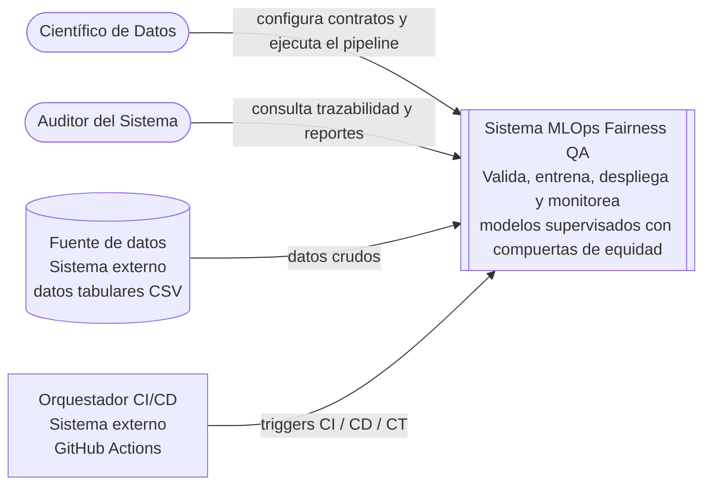
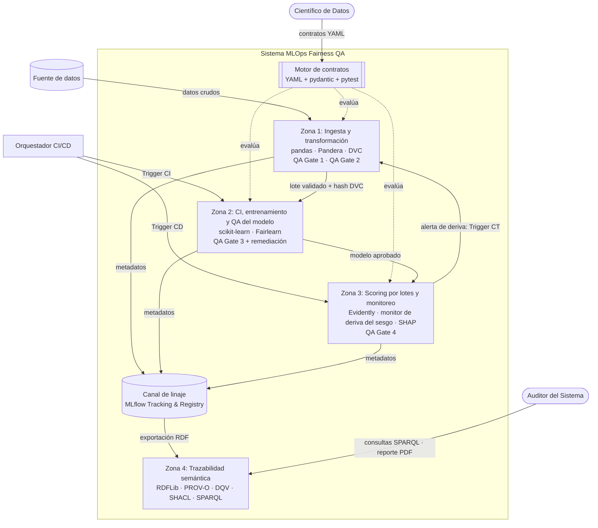
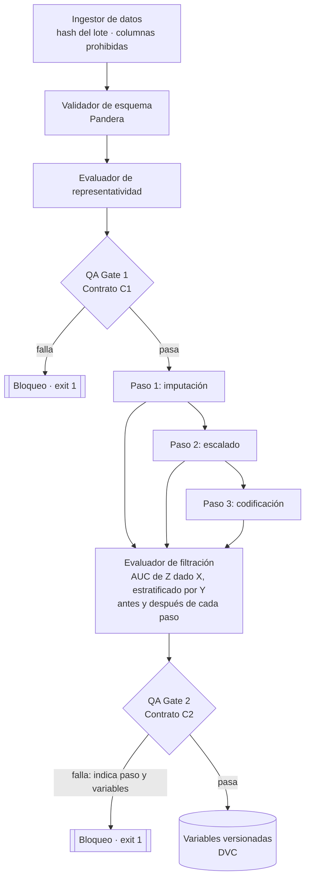
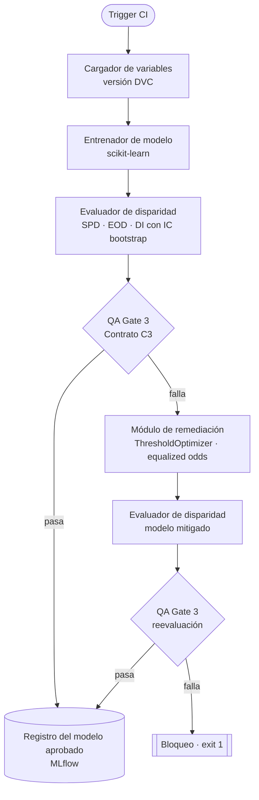
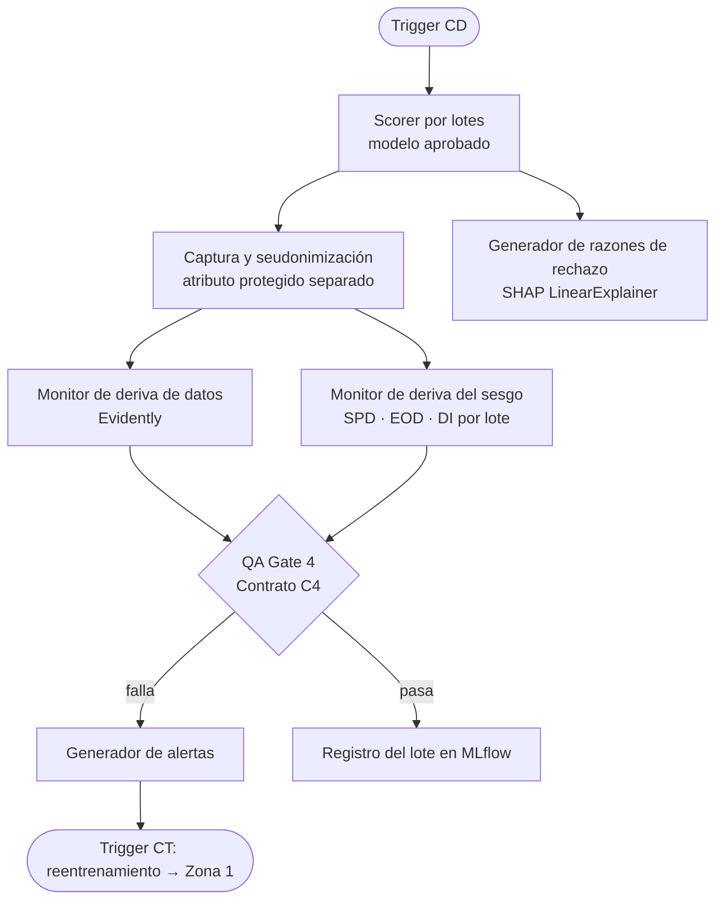
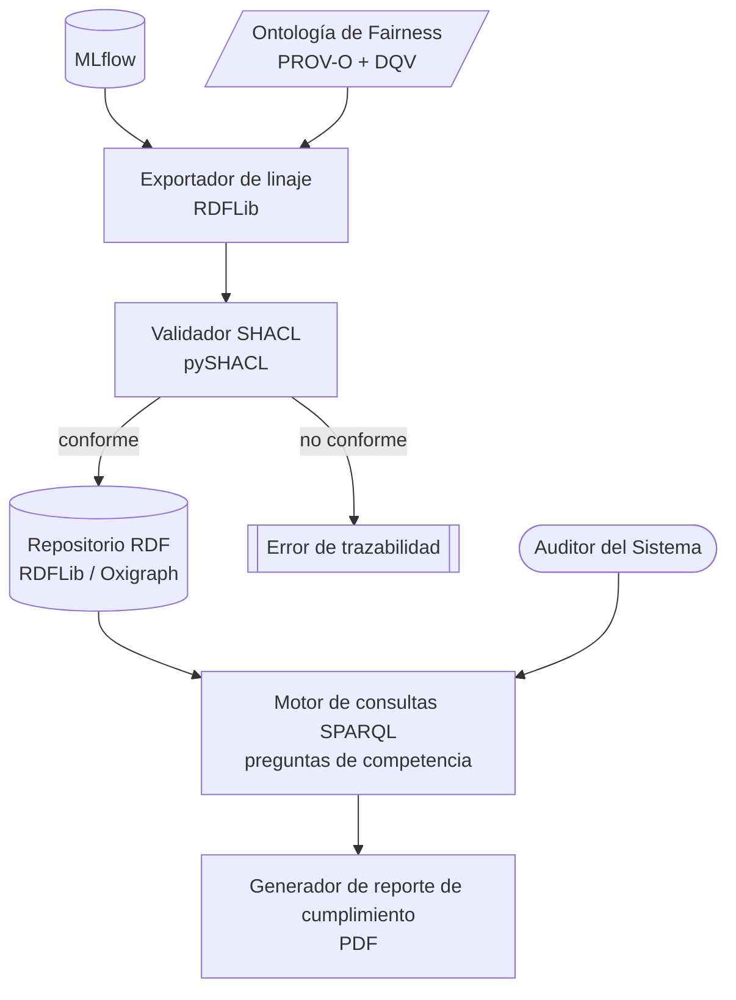

<!-- Fuente: 20202117_SergioChumbimuni_LuisVives_E2.pdf, pp. 53–80, REESCRITO el 2026-09-25 según estado/propuesta-diseno.md (aprobada por el autor). Ver capitulos/CAMBIOS.md, sección 5. Las Figuras 4–9 se especifican en Mermaid y deben redibujarse en Lucidchart. -->

# Capítulo 4: Diseño de la propuesta de solución

## 4.1 Introducción

El presente capítulo expone de manera formal el desarrollo metodológico y los productos de ingeniería correspondientes al Objetivo Específico O2 de esta investigación, el cual consiste en: "Diseñar el esquema de la arquitectura MLOps que integre compuertas de calidad (*QA Gates*) modulares, gobernadas por contratos de equidad declarativos, y un modelo semántico para garantizar la trazabilidad ética en todas las etapas del *pipeline* de *scoring* crediticio". En las organizaciones de tecnología financiera (*Fintech*), el aseguramiento de la equidad se ha abordado históricamente mediante auditorías estáticas, desarticuladas y tardías sobre el modelo final, asumiendo una concepción monolítica del pipeline de *Machine Learning* (Nguyen, 2024; Biswas & Rajan, 2021). Este enfoque impide localizar con precisión qué transformador de software o lote de datos específico inyectó la desviación discriminatoria, eleva los costos de depuración y expone a las entidades a sanciones bajo marcos regulatorios como la *Equal Credit Opportunity Act* (ECOA) de Estados Unidos, el Reglamento de IA de la Unión Europea o el Reglamento peruano de la Ley N.° 31814, que califican el uso de IA para la evaluación crediticia de personas como de riesgo alto (ECOA, 1974; Reglamento IA UE, 2024; PCM, 2025).

El diseño que se presenta obedece a tres principios. Primero, **cada control debe ser medible**: toda compuerta produce un valor numérico, un intervalo de confianza, un umbral y un resultado registrable. Segundo, **un único mecanismo evalúa todos los controles**: los contratos de equidad se expresan en un esquema declarativo común y son ejecutados por un mismo motor, lo que permite agregar atributos protegidos o métricas sin reescribir las pruebas. Tercero, **la trazabilidad se construye con vocabularios estándar** del W3C, reutilizando ontologías existentes en lugar de definir un vocabulario completamente nuevo.

En concordancia con las directrices de diseño metodológico, las secciones siguientes describen y verifican los tres resultados esperados: el esquema del sistema bajo el Modelo C4 (R.E.2.1), que define las cuatro zonas y la ubicación de las compuertas de calidad; la especificación de los componentes modulares de validación de equidad (R.E.2.2), que incluye el motor de contratos y la formulación matemática de los Contratos C1 a C4; y el modelo conceptual de trazabilidad semántica (R.E.2.3). Finalmente, se presenta una discusión que interpreta el diseño, lo contextualiza frente a la literatura y declara sus limitaciones.

## 4.2 Esquema arquitectónico detallado (Modelo C4) y flujos CI/CD

### 4.2.1. Descripción del resultado alcanzado

El primer resultado consiste en el diseño de la topología lógica de la solución, denominada "Sistema MLOps Fairness QA", modelada con el enfoque C4 en tres niveles de abstracción.

**Nivel 1: Diagrama de Contexto.** El sistema interactúa con dos usuarios y dos sistemas externos. El **Científico de Datos** configura los contratos de equidad y ejecuta el pipeline; el **Auditor del Sistema** consulta la trazabilidad y obtiene reportes de cumplimiento. El sistema recibe datos tabulares de una **Fuente de datos** externa y es activado por un **Orquestador de CI/CD** externo, que gestiona el código fuente y dispara los eventos de integración y entrega continua (*triggers*).



**Figura 4: Diagrama de Contexto (C4, Nivel 1)**

**Nivel 2: Diagrama de Contenedores.** El sistema se descompone en cuatro contenedores operativos, denominados "Zonas", más dos contenedores transversales:

- **Zona 1 (Ingesta, transformación y validación de datos):** pipeline de datos en Python con pandas, Pandera y DVC. Aloja la QA Gate 1 (Contrato C1) y la QA Gate 2 (Contrato C2).
- **Zona 2 (Integración continua, entrenamiento y QA del modelo):** pipeline de *Machine Learning* con scikit-learn y Fairlearn (Weerts et al., 2023). Aloja la QA Gate 3 (Contrato C3) y su etapa de remediación.
- **Zona 3 (Scoring por lotes y monitoreo continuo):** servicio de puntuación por lotes, monitor de deriva de datos (Evidently), monitor de deriva del sesgo (Contrato C4) y generador de razones de rechazo basado en SHAP.
- **Zona 4 (Trazabilidad semántica y auditoría):** exportador de metadatos a RDF con RDFLib, ontología basada en PROV-O y DQV, validación con SHACL, consultas SPARQL y generador del reporte de cumplimiento (Lebo et al., 2013; Albertoni & Isaac, 2016; Knublauch & Kontokostas, 2017).
- **Motor de contratos (transversal):** componente que carga los contratos declarativos (archivos YAML), valida su estructura, calcula las métricas y decide el resultado de cada compuerta en las Zonas 1, 2 y 3.
- **Canal de Linaje — MLflow (transversal):** registro de experimentos que actúa como único bus de metadatos entre las zonas (Zaharia et al., 2018). Las Zonas 1, 2 y 3 escriben en él la procedencia de los datos (hash de DVC), los parámetros, cada ejecución de compuerta, las métricas de equidad con sus intervalos de confianza, los modelos, las razones de rechazo y las alertas de deriva. La Zona 4 lo consume como **única fuente de entrada** para construir el grafo de conocimiento.



**Figura 5: Diagrama de Contenedores (C4, Nivel 2)**

**Nivel 3: Diagrama de Componentes y flujos CI/CD.** Este nivel detalla el comportamiento interno de cada zona y la ubicación de las compuertas de calidad (*QA Gates*):

- **Zona 1 (Ingesta y transformación):** el "Ingestor de datos" carga el lote crudo, calcula su hash (el mismo que registra DVC) y descarta las columnas declaradas como prohibidas en el contrato. El "Validador de esquema" (Pandera) y el "Evaluador de representatividad" ejecutan la **QA Gate 1** (Contrato C1). Si el lote pasa, los "Transformadores modulares" (imputación, escalado y codificación) se aplican **paso a paso**; después de cada paso, el "Evaluador de filtración de atributos protegidos" mide qué tan bien pueden predecirse los atributos protegidos a partir de las variables, lo compara con el paso anterior y ejecuta la **QA Gate 2** (Contrato C2). Si ambas compuertas pasan, el conjunto de variables se versiona con DVC.



**Figura 6: Diagrama de componentes de la Zona 1**

- **Zona 2 (CI, entrenamiento y QA del modelo):** al activarse el *Trigger CI*, el "Cargador de variables" obtiene la versión fijada en DVC y el "Entrenador de modelo" ajusta el clasificador supervisado base (regresión logística con pesos de clase balanceados). El "Evaluador de disparidad" calcula SPD, EOD y DI para cada atributo protegido, con intervalos de confianza obtenidos por *bootstrap*, y ejecuta la **QA Gate 3** (Contrato C3). Si el modelo base no cumple el contrato, el "Módulo de remediación" aplica la técnica de mitigación declarada en el contrato (post-procesamiento con `ThresholdOptimizer` de Fairlearn bajo la restricción de *equalized odds*) y la compuerta se evalúa nuevamente sobre el modelo mitigado (Hardt et al., 2016; Weerts et al., 2023). Solo un modelo que cumple el contrato se registra como versión aprobada en MLflow; si tampoco el modelo mitigado lo cumple, el despliegue se bloquea. En ambos casos se registran los dos modelos con sus métricas de exactitud y de equidad.



**Figura 7: Diagrama de componentes de la Zona 2**

- **Zona 3 (Scoring por lotes y monitoreo):** con la versión aprobada, el *Trigger CD* activa el "Scorer por lotes", que puntúa lotes de producción. Un componente de "Captura y seudonimización" almacena el atributo protegido **separado** de las variables del modelo y asociado a un identificador seudonimizado, para usarlo exclusivamente en el cálculo de métricas de equidad, en línea con la salvaguarda del artículo 10, apartado 5, del Reglamento europeo (Reglamento IA UE, 2024). El "Monitor de deriva de datos" (Evidently) compara la distribución de cada lote con la de entrenamiento, y el "Monitor de deriva del sesgo" recalcula las métricas del C3 por lote a medida que llegan las etiquetas observadas, ejecutando la **QA Gate 4** (Contrato C4). El "Generador de razones de rechazo" obtiene, para cada solicitante rechazado, las variables con mayor contribución negativa según SHAP. Si el C4 se incumple, el "Generador de alertas" registra la anomalía y dispara el reentrenamiento (*Trigger CT*) hacia la Zona 1.



**Figura 8: Diagrama de componentes de la Zona 3**

- **Zona 4 (Trazabilidad semántica):** el "Exportador de linaje" lee de MLflow las ejecuciones del pipeline y, con RDFLib, las serializa como tripletas RDF conforme a la "Ontología de Fairness", que reutiliza PROV-O para el linaje y DQV para las mediciones de calidad (Lebo et al., 2013; Albertoni & Isaac, 2016). El "Validador SHACL" comprueba que cada ejecución registrada cumpla las restricciones estructurales de la ontología (Knublauch & Kontokostas, 2017). Las tripletas validadas se almacenan en un repositorio RDF local (RDFLib u Oxigraph; GraphDB es opcional para la exploración visual), sobre el cual el "Motor de consultas" ejecuta las preguntas de competencia en SPARQL y el "Generador de reportes" compila el reporte de cumplimiento en PDF para el Auditor.



**Figura 9: Diagrama de componentes de la Zona 4**

### 4.2.2 Metodología de logro y reproducibilidad

Para alcanzar este resultado se siguió un proceso iterativo de cuatro pasos:

1. **Identificación de fronteras de datos y de ejecución:** se estableció como restricción de diseño que el pipeline sea **reproducible de forma idéntica en local y en integración continua**: las mismas pruebas se ejecutan en la estación de trabajo del desarrollador y en los ejecutores de GitHub Actions, con versiones de dependencias fijadas. La confidencialidad no se garantiza aislando la red, sino tratando los datos: los repositorios de código y de datos son privados, el dataset no se redistribuye y el atributo protegido se seudonimiza en la operación (Zona 3).
2. **Delimitación de zonas operativas:** se aplicó el principio de separación de responsabilidades (*separation of concerns*) para segmentar el ciclo de vida del scoring crediticio en cuatro zonas, y se extrajeron como componentes transversales el motor de contratos y el canal de linaje, de modo que ninguna zona dependa de la implementación interna de otra.
3. **Modelado visual bajo el estándar C4:** se construyeron de forma secuencial las abstracciones de Contexto, Contenedores y Componentes (Figuras 4 a 9), etiquetando los flujos de datos, los eventos de control (*triggers*) y los puntos de bloqueo.
4. **Validación del flujo de automatización (CI/CD/CT):** se mapearon los disparadores: cualquier cambio de código, de contratos o de datos dispara un *Trigger CI* en la Zona 2; la aprobación de un modelo dispara el *Trigger CD* hacia la Zona 3; y una violación del Contrato C4 dispara un reentrenamiento (*Trigger CT*) de retorno a la Zona 1, cerrando el ciclo de vida automatizado.

### 4.2.3. Verificación de existencia

La existencia de este resultado se verifica en los diagramas del sistema incluidos en la presente tesis:

- **Figura 4** (Diagrama de Contexto - Nivel 1): fronteras del sistema, actores y sistemas externos.
- **Figura 5** (Diagrama de Contenedores - Nivel 2): cuatro zonas operativas, motor de contratos y canal de linaje.
- **Figuras 6, 7, 8 y 9** (Diagramas de Componentes - Nivel 3): flujos internos de validación de datos y transformadores, entrenamiento y remediación, operación y monitoreo, y trazabilidad semántica.

### 4.2.4 Mediciones y validación del indicador

El cumplimiento de este entregable se valida con el indicador del R.E.2.1 establecido en el Capítulo 1 (Tabla 2): *"Presentación de diagramas que identifiquen explícitamente las cuatro (4) zonas del pipeline, la capa de persistencia semántica, el flujo de integración continua y la ubicación estratégica de las compuertas de calidad (QA Gates)"*.

La revisión de cobertura del diseño verifica los siguientes elementos:

1. **Las 4 zonas:** Zona 1 (ingesta y transformación), Zona 2 (CI, entrenamiento y QA del modelo), Zona 3 (scoring y monitoreo) y Zona 4 (trazabilidad semántica), con fronteras explícitas en la Figura 5.
2. **Capa de persistencia semántica:** Zona 4, alimentada exclusivamente desde el canal de linaje (MLflow).
3. **Flujo de integración continua:** eventos *Trigger CI*, *Trigger CD* y *Trigger CT* representados en las Figuras 5, 7 y 8.
4. **Ubicación de las compuertas de calidad:**
   - **QA Gate 1 (datos crudos):** Zona 1, tras el validador de esquema y antes de cualquier transformación.
   - **QA Gate 2 (transformadores):** Zona 1, evaluada después de **cada** paso de preprocesamiento.
   - **QA Gate 3 (modelo):** Zona 2, sobre el modelo base y, si corresponde, sobre el modelo remediado, antes de habilitar su registro y entrega.
   - **QA Gate 4 (producción):** Zona 3, sobre cada lote puntuado.

## 4.3 Especificación de diseño de los componentes modulares de validación de equidad

### 4.3.1. Descripción del resultado alcanzado

El segundo resultado es la especificación de los componentes lógicos de validación. A diferencia de las evaluaciones convencionales, que operan de manera reactiva sobre el modelo final, esta especificación define un control modular basado en el paradigma de Diseño por Contrato (DbC), en el que cada etapa del pipeline tiene precondiciones y postcondiciones de equidad verificables (Nguyen, 2024).

Cada compuerta es una función de aserción que recibe entradas específicas, evalúa las reglas de su contrato y retorna un resultado binario (Pasa / Falla). Si alguna regla con severidad `block` falla, el proceso termina con código de salida distinto de cero (*exit 1*), lo que detiene el pipeline de integración continua e impide la propagación del sesgo (Nguyen, 2024). Las reglas con severidad `warn` solo se registran.

| Contrato | Compuerta | Zona | Punto de control | Naturaleza (DbC) |
|---|---|---|---|---|
| C1 | QA Gate 1 | Zona 1 | Datos crudos (antes de transformar) | Precondición del pipeline |
| C2 | QA Gate 2 | Zona 1 | Salida de cada transformador | Postcondición de cada transformador |
| C3 | QA Gate 3 | Zona 2 | Modelo entrenado (base y remediado) | Postcondición del entrenamiento |
| C4 | QA Gate 4 | Zona 3 | Lotes puntuados en producción | Invariante de operación |

**Tabla 10: Contratos de Equidad**

Para que los contratos sean auditables, versionables y desacoplados del código (evitando "umbrales mágicos" incrustados), todos comparten un **esquema declarativo común** en formato YAML. El motor de contratos valida cada archivo contra este esquema antes de ejecutarlo, genera una prueba automatizada por cada combinación de regla y atributo protegido, y produce para cada una un registro de ejecución que se envía al canal de linaje.

| Campo | Tipo de dato | Descripción |
|---|---|---|
| `contract_id` | String | Identificador único del contrato (ej. C3) |
| `version` | String | Versión del contrato; cada cambio de umbral genera una versión nueva |
| `gate` | String | Compuerta a la que pertenece (ej. QA_GATE_3) |
| `stage` | String | Etapa del pipeline donde se evalúa (ej. modelo_entrenado) |
| `dataset` | String | Caso de estudio al que aplica (ej. davronov) |
| `protected_attributes` | List (Object) | Atributos protegidos: nombre, grupos y grupo no privilegiado (o `null` si no se conoce) |
| `rules` | List (Object) | Reglas: `id`, `metric`, `operator`, `threshold` y `severity` (`block` o `warn`) |
| `statistics` | Object | Método de estimación de la incertidumbre (ej. *bootstrap*, número de remuestreos, nivel de confianza) |
| `remediation` | Object | Técnica de mitigación a aplicar si el contrato falla (solo C3) |
| `tooling` | String | Biblioteca responsable del cálculo de las métricas (ej. fairlearn) |

**Tabla 11: Esquema declarativo común de un contrato**

El motor de contratos incorpora tres decisiones de diseño:

- **Métricas simétricas o direccionales.** Cuando se conoce el grupo no privilegiado, el Impacto Dispar se calcula de forma direccional (tasa de selección del grupo no privilegiado sobre la del privilegiado). Cuando la codificación del atributo no permite identificarlo, se usan las versiones simétricas: la diferencia absoluta entre grupos para SPD y EOD, y el cociente entre la menor y la mayor tasa de selección para DI.
- **Decisión con incertidumbre.** Cada métrica se estima con un intervalo de confianza por *bootstrap* (Efron & Tibshirani, 1993), y la compuerta decide con el extremo del intervalo más desfavorable respecto del umbral. Así se evita que un grupo pequeño haga aprobar o fallar el contrato por azar de la partición de datos.
- **Resultados estructurados.** Cada evaluación genera un registro con el contrato, la regla, el atributo, el valor estimado, su intervalo, el umbral, el resultado y el hash del lote evaluado, que alimenta la trazabilidad de la Zona 4.

### 4.3.2. Metodología de logro y reproducibilidad

De conformidad con la Fase 2 (Diseño Arquitectónico y Formulación de Contratos) de la Sección 1.3.2, este entregable se alcanzó articulando la formulación estadística de la equidad algorítmica con el paradigma de Diseño por Contrato (Nguyen, 2024), en cuatro etapas:

A. **Modelado matemático del scoring crediticio y de los casos de estudio.** Se formalizó la tarea como clasificación binaria supervisada, con X el vector de variables del solicitante, Y ∈ {0, 1} la etiqueta real (1 = buen pagador, 0 = *default*) y un conjunto de atributos protegidos Z = {Z₁, …, Zₘ}, cada uno con sus grupos (MathWorks, s.f.). Se caracterizaron los dos casos de estudio de la Tabla 14.

B. **Definición de aserciones para datos y transformadores.** Se diseñaron las precondiciones sobre los datos crudos (C1) y las postcondiciones de cada transformador (C2), operativizando la naturaleza composicional del sesgo: una transformación intermedia puede introducir o amplificar la dependencia respecto del atributo protegido aunque los datos de entrada no la tuvieran (Biswas & Rajan, 2021).

C. **Formulación de aserciones sobre el modelo y la operación.** Se integraron en la postcondición del entrenamiento (C3) y en el invariante de operación (C4) las métricas de equidad de grupo de Hardt et al. (2016), con umbrales de tolerancia basados en la regla de los cuatro quintos (Uniform Guidelines on Employee Selection Procedures, 1978) y en la doctrina de impacto dispar aplicada al crédito (Bartlett et al., 2022).

D. **Calibración de umbrales con casos conocidos.** Los umbrales que no provienen de la literatura (en particular, los del C2) se calibran con un caso positivo conocido: la variable `Marital` del dataset Davronov, cuya inclusión reintroduce información del atributo `Sex` (ver 4.3.3), y con el mismo pipeline sin esa variable como caso negativo.

| Caso | Fuente | Registros | Atributos protegidos | Etiqueta | Uso en la tesis |
|---|---|---|---|---|---|
| **Davronov** (principal) | Kaggle, "Credit-scoring data" (Davronov, 2021); reportado como proveniente de una fintech de Asia Central (Giang Thi Thu et al., 2024) | 8 707 (+ 48 del archivo de prueba) | `Sex` (grupos 1 y 2; codificación no documentada) y `Age_group` (<25: 7,5 %; ≥25: 92,5 %) | `label` = 1 buen pagador (92,3 %), 0 *default* (7,7 %) | Zonas 1–3, Contratos C1–C4, escenarios E0–E5 |
| **HMDA** (secundario) | Datos públicos del registro de solicitudes hipotecarias de EE. UU. (Federal Financial Institutions Examination Council [FFIEC], s.f.) | Recorte de un estado y dos años | Sexo, raza, etnia y edad, autodeclarados | Decisión del prestamista (aprobado / denegado) | Deriva real entre años (E6) y verificación de que el diseño no depende del dataset |

**Tabla 14: Casos de estudio y atributos protegidos**

### 4.3.3. Verificación de existencia

La existencia de este resultado se verifica en la especificación técnica de los contratos: los archivos YAML de C1 a C4, el esquema de validación del motor de contratos y las firmas de las funciones de métricas. A continuación se muestra la instancia del Contrato C3 para el caso Davronov:

```yaml
contract_id: C3
version: "2.0"
gate: QA_GATE_3
stage: modelo_entrenado
dataset: davronov
protected_attributes:
  - {name: Sex, groups: [1, 2], unprivileged: null}        # codificación no documentada: métricas simétricas
  - {name: Age_group, groups: ["<25", ">=25"], unprivileged: "<25"}
rules:
  - {id: C3-SPD, metric: spd, operator: le, threshold: 0.10, severity: block}
  - {id: C3-EOD, metric: eod, operator: le, threshold: 0.10, severity: block}
  - {id: C3-DI,  metric: di,  operator: ge, threshold: 0.80, severity: block}
  - {id: C3-ACC, metric: balanced_accuracy_drop, operator: le, threshold: 0.05, severity: warn}
statistics: {method: bootstrap, n_resamples: 500, confidence: 0.95, decide_on: worst_bound}
remediation: {enabled: true, method: threshold_optimizer, constraint: equalized_odds}
tooling: fairlearn
```

El diseño se contrastó con el caso Davronov. En la etiqueta real, la proporción de buenos pagadores es de 94,1 % en el grupo 1 de `Sex` y de 91,2 % en el grupo 2 (diferencia de 2,9 puntos porcentuales), y de 84,0 % en menores de 25 años frente a 93,0 % en el resto (diferencia de 9,0 puntos). Además, el cruce entre `Marital` y `Sex` muestra que 6 de las 7 categorías de estado civil corresponden en su totalidad a un solo grupo de `Sex`, lo que convierte a `Marital` en un sustituto casi perfecto del atributo protegido: es precisamente el tipo de discriminación por proxy descrito en la Sección 2.1.2 y el caso que el Contrato C2 debe detectar.

### 4.3.4. Mediciones y validación del indicador

El cumplimiento del R.E.2.2 se valida con su indicador del Capítulo 1 (Tabla 2): *"Formulación matemática explícita de las reglas, aserciones y umbrales tolerables de equidad e integridad de datos para las compuertas de calidad (QA Gates) del pipeline"*.

La especificación cumple con este indicador al formular matemáticamente los siguientes contratos. En lo que sigue, para cada atributo protegido Zⱼ con grupos g ∈ Gⱼ, $D$ denota el lote evaluado.

**Contrato C1: QA Gate 1 (Integridad y representatividad de los datos crudos)**

- **Naturaleza:** precondición de datos.
- **Integridad:** cada columna declarada cumple su tipo, rango y valores permitidos; ninguna columna excede la proporción máxima de nulos, y el lote no excede la proporción máxima de duplicados:

  $$\forall c \in Columnas(D):\ Tipo(c) \in \top_{permitidos} \ \wedge\ \frac{Nulos(c)}{|D|} \le 0.05, \qquad \frac{Duplicados(D)}{|D|} \le 0.01$$

- **Columnas prohibidas:** ninguna variable declarada como fuga de la variable objetivo (en Davronov, `Score_level`, `Score_class` y `Score_point`) puede formar parte de las variables del modelo.
- **Representatividad:** cada grupo de cada atributo protegido supera la proporción mínima:

  $$\forall j,\ \forall g \in G_j:\ P(Z_j = g \mid D) \ge \top_{rep} = 0.05$$

- **Interpretación:** si el lote vulnera la integridad o algún grupo protegido representa menos del 5 % del lote, el contrato falla y el pipeline se detiene antes de alimentar los transformadores.

**Contrato C2: QA Gate 2 (Aislamiento del sesgo composicional en transformadores)**

- **Naturaleza:** postcondición de cada transformador (imputación, escalado, codificación).
- **Indicador de filtración:** para las variables $X^{(k)}$ obtenidas después del paso $k$, se entrena un clasificador auxiliar que intenta predecir el atributo protegido $Z_j$ dentro de cada estrato de la etiqueta real Y, y se promedia su área bajo la curva ROC ponderando por el tamaño del estrato:

  $$L_j^{(k)} = \sum_{y \in \{0,1\}} P(Y = y)\cdot AUC\big(Z_j \mid X^{(k)},\ Y = y\big)$$

  Un valor cercano a 0,5 indica que las variables no permiten reconstruir el atributo protegido más allá del azar, una vez conocida la etiqueta. Condicionar en Y corresponde a la noción de independencia condicional de la información mutua condicional $I(X; Z \mid Y)$, que se conserva como métrica secundaria.
- **Reglas:**

  $$L_j^{(k)} \le \top_{proxy} = 0.60 \qquad \text{y} \qquad L_j^{(k)} - L_j^{(k-1)} \le \delta = 0.02$$

- **Localización:** cuando el contrato falla, el reporte identifica el paso $k$ responsable y las variables con mayor importancia en el clasificador auxiliar.
- **Interpretación:** si un transformador (por ejemplo, una imputación que depende del grupo o una codificación que reintroduce `Marital`) aumenta la capacidad de reconstruir el atributo protegido por encima del incremento tolerado, o si el indicador supera el tope absoluto, el contrato falla y señala el paso exacto, evitando delegar la detección a la auditoría del modelo final (Biswas & Rajan, 2021). Los valores 0,60 y 0,02 son iniciales y se calibran según la etapa D de 4.3.2.

**Contrato C3: QA Gate 3 (Evaluación ética del modelo entrenado, con remediación)**

- **Naturaleza:** postcondición del entrenamiento. Evalúa las predicciones $\widehat{Y} = h(X)$ para cada atributo protegido. Cuando el grupo no privilegiado $u$ y el privilegiado $p$ son conocidos:

  $$|SPD| = |P(h(X) = 1 \mid Z = u) - P(h(X) = 1 \mid Z = p)| \le \epsilon_{SPD} = 0.10$$

  $$|EOD| = |P(h(X) = 1 \mid Y = 1, Z = u) - P(h(X) = 1 \mid Y = 1, Z = p)| \le \epsilon_{EOD} = 0.10$$

  $$DI = \frac{P(h(X) = 1 \mid Z = u)}{P(h(X) = 1 \mid Z = p)} \ge 0.80$$

  Cuando la codificación no permite identificar el grupo no privilegiado, se usan las formas simétricas: $\max_g - \min_g$ de las tasas para SPD y EOD, y $\min_g / \max_g$ de las tasas de selección para DI. La métrica EOD corresponde al criterio de igualdad de oportunidades de Hardt et al. (2016), y el umbral de DI a la regla de los cuatro quintos, según la cual una tasa de selección "less than four-fifths (4/5) (or eighty percent) of the rate for the group with the highest rate will generally be regarded by the Federal enforcement agencies as evidence of adverse impact" (Uniform Guidelines on Employee Selection Procedures, 1978, § 1607.4(D)).
- **Guardia de exactitud (`warn`):** la pérdida de exactitud balanceada del modelo remediado respecto del base no debe superar 0,05, de modo que el costo de la equidad quede documentado (Menon & Williamson, 2018).
- **Incertidumbre:** cada métrica se estima con un intervalo de confianza al 95 % por *bootstrap* con 500 remuestreos (Efron & Tibshirani, 1993), y se decide con el extremo más desfavorable.
- **Remediación:** si el modelo base incumple alguna regla `block`, se aplica el post-procesamiento declarado en el contrato (`ThresholdOptimizer` con restricción de *equalized odds*, que ajusta umbrales de decisión por grupo sobre el modelo ya entrenado) y la compuerta se reevalúa (Hardt et al., 2016; Weerts et al., 2023). El atributo protegido se usa únicamente en este post-procesamiento, nunca como variable de entrada del modelo.

**Contrato C4: QA Gate 4 (Deriva de datos y deriva del sesgo en producción)**

- **Naturaleza:** invariante de operación, evaluado sobre cada lote puntuado $B_t$.
- **Deriva de datos (`warn`):** proporción de variables cuya distribución en $B_t$ difiere significativamente de la de entrenamiento, según las pruebas de Evidently, menor o igual a 0,30.
- **Deriva del sesgo (`block`):** las reglas del C3 recalculadas sobre $B_t$ con las etiquetas observadas. Su incumplimiento dispara el *Trigger CT* (Reda et al., 2025).

**Mecanismo de interrupción y remediación (común a C1–C4)**

- El motor de contratos carga y valida el archivo YAML correspondiente.
- Pytest ejecuta una prueba por cada combinación de regla y atributo protegido, con las métricas calculadas mediante Pandera, scikit-learn y Fairlearn.
- Si todas las reglas `block` se cumplen, el pipeline continúa.
- Si una regla `block` se incumple: en C3 se ejecuta primero la remediación declarada; si persiste el incumplimiento, o en C1, C2 y C4, el proceso termina con **exit 1**, el orquestador de CI/CD detiene el flujo y el resultado queda registrado en el canal de linaje (MLflow), desde donde se serializa como tripletas RDF en la Zona 4 (R.E.2.3).

## 4.4. Modelo conceptual de trazabilidad y gobernanza semántica

### 4.4.1. Descripción del resultado alcanzado

El tercer resultado es el modelo conceptual del grafo de conocimiento y la **Ontología de Fairness** que estructura el linaje del sistema. En un sistema de scoring de riesgo alto no basta con interrumpir un pipeline sesgado: el Reglamento peruano exige, para estos sistemas, "mantener un registro actualizado y accesible, con enfoque preventivo, sobre los principios del funcionamiento del sistema, las fuentes de datos utilizadas y la lógica del algoritmo" (PCM, 2025, art. 31.1), y el Reglamento europeo exige documentación técnica y registro automático de eventos (Reglamento IA UE, 2024).

En lugar de definir un vocabulario completamente nuevo, la ontología **reutiliza dos vocabularios del W3C** y define solo los conceptos propios del dominio:

- **PROV-O**, que "expresses the PROV Data Model using the OWL2 Web Ontology Language" (Lebo et al., 2013, Resumen), modela el linaje: qué actividad (ejecución de compuerta, entrenamiento, puntuación) usó qué entidades (lote, contrato, modelo) y cuáles generó.
- **DQV** proporciona el concepto de medición de calidad; su clase `dqv:QualityMeasurement` "represents the evaluation of a given dataset (or dataset distribution) against a specific quality metric" (Albertoni & Isaac, 2016, sección 4.1). Cada métrica de equidad calculada por una compuerta se representa como una medición de este tipo.
- **SHACL**, "a language for validating RDF graphs against a set of conditions" (Knublauch & Kontokostas, 2017, Resumen), define las restricciones que todo registro debe cumplir antes de incorporarse al grafo.

| Clase | Descripción | Zona de origen | Vocabulario base |
|---|---|---|---|
| `fair:DataBatch` | Lote de datos identificado por su hash de versión (DVC) | Zona 1 | `prov:Entity` |
| `fair:TransformationStep` | Paso de preprocesamiento (imputación, escalado, codificación) | Zona 1 | `prov:Activity` |
| `fair:FairnessContract` | Contrato de equidad versionado (C1–C4) | Transversal | `prov:Entity` |
| `fair:Rule` | Regla de un contrato: métrica, operador, umbral y severidad | Transversal | `prov:Entity` |
| `fair:ProtectedAttribute` | Atributo protegido y sus grupos (ej. `Sex`, `Age_group`) | Transversal | `prov:Entity` |
| `fair:GateExecution` | Ejecución de una compuerta sobre un lote o modelo, con resultado Pasa/Falla | Zonas 1–3 | `prov:Activity` |
| `fair:FairnessMeasurement` | Valor de una métrica para una regla y un atributo, con su intervalo de confianza | Zonas 1–3 | `dqv:QualityMeasurement` |
| `fair:ModelVersion` | Versión de un clasificador (base o remediado) registrada en MLflow | Zona 2 | `prov:Entity` |
| `fair:Remediation` | Aplicación de una técnica de mitigación a un modelo | Zona 2 | `prov:Activity` |
| `fair:AdverseActionReason` | Razón de rechazo generada para un solicitante seudonimizado | Zona 3 | `prov:Entity` |
| `fair:DriftAlert` | Alerta de deriva de datos o del sesgo sobre un lote | Zona 3 | `prov:Entity` |
| `fair:ComplianceReport` | Reporte de cumplimiento generado a partir del grafo | Zona 4 | `prov:Entity` |

**Tabla 12: Taxonomía de clases de la Ontología de Fairness**

### 4.4.2. Metodología de logro y reproducibilidad

El modelado se basó en la metodología de ingeniería ontológica de Noy y McGuinness (2001), en cuatro pasos:

- **Determinación del alcance mediante preguntas de competencia:** la ontología debe permitir responder, entre otras: (PC1) ¿qué contrato y regla bloquearon un modelo, con qué valor e intervalo?; (PC2) ¿con qué lote (hash) se entrenó el modelo aprobado?; (PC3) ¿qué razones de rechazo se comunicaron a un solicitante?; (PC4) ¿qué alertas de deriva del sesgo ocurrieron en un periodo?; (PC5) ¿cuál fue la diferencia de exactitud y de equidad entre el modelo base y el remediado?
- **Reutilización de ontologías existentes:** se incorporaron PROV-O y DQV como vocabularios base, conforme a la recomendación de reutilizar vocabularios establecidos (Noy & McGuinness, 2001; Russo & Vidal, 2025).
- **Definición de clases, propiedades y restricciones:** se definieron las clases propias (Tabla 12), las propiedades de objeto y de datos (Tabla 13) y las formas SHACL que garantizan la completitud de cada registro.
- **Validación:** cada grafo exportado se valida contra las formas SHACL y se comprueba que las cinco preguntas de competencia se respondan con consultas SPARQL.

La siguiente consulta responde la PC1 para el atributo `Sex` en las ejecuciones recientes:

```sparql
PREFIX fair: <https://pucp.edu.pe/ontology/fair#>
PREFIX prov: <http://www.w3.org/ns/prov#>
PREFIX dqv:  <http://www.w3.org/ns/dqv#>
PREFIX xsd:  <http://www.w3.org/2001/XMLSchema#>

SELECT ?execution ?contractId ?ruleId ?value ?ciLow ?ciHigh ?threshold ?model ?timestamp
WHERE {
    # 1. Ejecuciones de compuerta que fallaron
    ?execution a fair:GateExecution ;
               fair:gatePassed false ;
               fair:appliesRule ?rule ;
               prov:used ?model ;
               prov:startedAtTime ?timestamp .
    ?model a fair:ModelVersion .

    # 2. Regla, contrato y umbral
    ?rule fair:ruleId ?ruleId ;
          fair:threshold ?threshold ;
          fair:partOfContract ?contract .
    ?contract fair:contractId ?contractId .

    # 3. Medición que causó el fallo, restringida al atributo Sex
    ?measurement a fair:FairnessMeasurement ;
                 prov:wasGeneratedBy ?execution ;
                 fair:concernsAttribute ?attribute ;
                 dqv:value ?value ;
                 fair:ciLow ?ciLow ;
                 fair:ciHigh ?ciHigh .
    ?attribute fair:attributeName "Sex" .

    FILTER(?timestamp >= "2026-07-25T00:00:00Z"^^xsd:dateTime)
}
ORDER BY DESC(?timestamp)
```

La resolución de esta consulta permite extraer del grafo la evidencia de un bloqueo, que el generador de reportes de la Zona 4 incorpora al reporte de cumplimiento (Russo et al., 2024).

### 4.4.3. Verificación de existencia

La existencia de este resultado se verifica en el esquema de la ontología serializado en sintaxis Turtle y en su archivo de formas SHACL. Para mostrar que el diseño es instanciable, se presenta una instanciación **ilustrativa** en Turtle de una ejecución de la QA Gate 3 sobre el modelo base del caso Davronov. El hash y el número de registros corresponden al lote real; el valor de la métrica y su intervalo son ilustrativos:

```turtle
@prefix fair: <https://pucp.edu.pe/ontology/fair#> .
@prefix prov: <http://www.w3.org/ns/prov#> .
@prefix dqv:  <http://www.w3.org/ns/dqv#> .
@prefix xsd:  <http://www.w3.org/2001/XMLSchema#> .

# 1. Lote de datos versionado en DVC (caso Davronov)
fair:DataBatch_Davronov_train
    a fair:DataBatch ;
    fair:dvcHash "1aa87791dbf04be9e8440f4eef1ebc54" ;
    fair:recordsCount 8707 .

# 2. Contrato C3 y su regla de paridad estadística
fair:Contract_C3_v2
    a fair:FairnessContract ;
    fair:contractId "C3" ;
    fair:version "2.0" .

fair:Rule_C3_SPD
    a fair:Rule ;
    fair:ruleId "C3-SPD" ;
    fair:partOfContract fair:Contract_C3_v2 ;
    fair:metricName "spd" ;
    fair:operator "le" ;
    fair:threshold "0.10"^^xsd:decimal ;
    fair:severity "block" .

fair:Attribute_Sex
    a fair:ProtectedAttribute ;
    fair:attributeName "Sex" .

# 3. Modelo base entrenado sobre el lote
fair:Model_LR_base_v1
    a fair:ModelVersion ;
    prov:wasDerivedFrom fair:DataBatch_Davronov_train .

# 4. Ejecución fallida de la QA Gate 3 sobre el modelo base
fair:GateExecution_C3_0001
    a fair:GateExecution ;
    fair:appliesRule fair:Rule_C3_SPD ;
    prov:used fair:Model_LR_base_v1 ;
    fair:gatePassed false ;
    prov:startedAtTime "2026-08-18T04:14:00Z"^^xsd:dateTime .

# 5. Medición que causó el fallo (valores ilustrativos)
fair:Measurement_C3_0001_SPD_Sex
    a fair:FairnessMeasurement , dqv:QualityMeasurement ;
    prov:wasGeneratedBy fair:GateExecution_C3_0001 ;
    fair:concernsAttribute fair:Attribute_Sex ;
    dqv:value "0.18"^^xsd:decimal ;
    fair:ciLow "0.14"^^xsd:decimal ;
    fair:ciHigh "0.22"^^xsd:decimal .

# 6. Remediación aplicada al modelo base
fair:Remediation_0001
    a fair:Remediation ;
    fair:method "threshold_optimizer" ;
    fair:constraint "equalized_odds" ;
    prov:used fair:Model_LR_base_v1 .
```

La completitud de cada ejecución se garantiza con formas SHACL como la siguiente, que exige que toda ejecución de compuerta tenga regla, resultado, marca de tiempo y el modelo o lote evaluado:

```turtle
@prefix sh:   <http://www.w3.org/ns/shacl#> .
@prefix fair: <https://pucp.edu.pe/ontology/fair#> .
@prefix prov: <http://www.w3.org/ns/prov#> .
@prefix xsd:  <http://www.w3.org/2001/XMLSchema#> .

fair:GateExecutionShape
    a sh:NodeShape ;
    sh:targetClass fair:GateExecution ;
    sh:property [ sh:path fair:appliesRule ;       sh:minCount 1 ; sh:class fair:Rule ] ;
    sh:property [ sh:path fair:gatePassed ;        sh:minCount 1 ; sh:maxCount 1 ; sh:datatype xsd:boolean ] ;
    sh:property [ sh:path prov:startedAtTime ;     sh:minCount 1 ; sh:datatype xsd:dateTime ] ;
    sh:property [ sh:path prov:used ;              sh:minCount 1 ] .
```

### 4.4.4. Mediciones y validación de indicador

El cumplimiento del entregable se valida con el indicador del R.E.2.3 del Capítulo 1 (Tabla 2): *"Modelo conceptual estructurado que interconecte las entidades de datos, modelo, métricas de sesgo y resultados de ejecución, validable mediante restricciones formales"*.

La interconexión exigida se define mediante las propiedades de la ontología:

| Propiedad | Dominio → Rango | Significado |
|---|---|---|
| `prov:used` | `fair:GateExecution` → `fair:DataBatch` / `fair:ModelVersion` | Lote o modelo evaluado por la compuerta |
| `prov:wasGeneratedBy` | `fair:FairnessMeasurement` → `fair:GateExecution` | Ejecución que produjo la medición |
| `prov:wasDerivedFrom` | `fair:ModelVersion` → `fair:DataBatch` / `fair:ModelVersion` | Lote con el que se entrenó el modelo, o modelo base del que deriva un modelo remediado |
| `fair:appliesRule` | `fair:GateExecution` → `fair:Rule` | Regla evaluada |
| `fair:partOfContract` | `fair:Rule` → `fair:FairnessContract` | Contrato al que pertenece la regla |
| `fair:concernsAttribute` | `fair:FairnessMeasurement` → `fair:ProtectedAttribute` | Atributo protegido medido |
| `fair:afterStep` | `fair:GateExecution` → `fair:TransformationStep` | Paso de preprocesamiento evaluado (C2) |
| `fair:explainsDecisionOf` | `fair:AdverseActionReason` → `fair:ModelVersion` | Modelo cuya decisión se explica |
| `fair:raisedOn` | `fair:DriftAlert` → `fair:DataBatch` | Lote de producción donde se detectó la deriva |
| `fair:documents` | `fair:ComplianceReport` → `fair:GateExecution` / `fair:DriftAlert` | Hechos incluidos en el reporte de cumplimiento |

**Tabla 13: Propiedades principales de la Ontología de Fairness**

Las propiedades de datos asocian valores literales a los nodos del grafo: `dqv:value` (valor de la métrica), `fair:ciLow` y `fair:ciHigh` (intervalo de confianza), `fair:threshold`, `fair:operator` y `fair:severity` (definición de la regla), `fair:gatePassed` (resultado lógico), `fair:dvcHash` y `fair:recordsCount` (identificación del lote), y `prov:startedAtTime` (marca temporal de la ejecución). Todas ellas están cubiertas por formas SHACL, de modo que el indicador se verifica de manera automática: un grafo que no conforma las formas no se incorpora al repositorio.

## 4.5. Discusión

### 4.5.1. Síntesis de los resultados principales

El desarrollo del Objetivo Específico 2 consolidó un diseño abstracto, matemático y semántico para el aseguramiento de la equidad en el scoring crediticio. El primer resultado (R.E.2.1) define la topología bajo el Modelo C4: cuatro zonas operativas, un motor de contratos y un canal de linaje transversales, y cuatro compuertas de calidad ubicadas en los datos, en cada transformador, en el modelo y en la operación. El segundo resultado (R.E.2.2) formaliza los Contratos C1 a C4 en un esquema declarativo común, con métricas simétricas o direccionales según la información disponible, decisiones basadas en intervalos de confianza y una remediación explícita en el Contrato C3. El tercer resultado (R.E.2.3) modela la trazabilidad reutilizando PROV-O y DQV y garantiza su completitud con formas SHACL.

### 4.5.2. Interpretación del significado de los resultados

En primer lugar, el diseño traslada el aseguramiento de la equidad desde una auditoría tardía y *post-hoc* hacia un control continuo y preventivo (*Shift-Left Testing*). Al evaluar cada transformador por separado, el Contrato C2 no solo detecta la filtración de información del atributo protegido, sino que **localiza** el paso que la introdujo, que es la capacidad que un análisis de caja negra sobre el modelo final no ofrece (Biswas & Rajan, 2021).

En segundo lugar, la remediación explícita del Contrato C3 convierte el dilema de precisión frente a equidad en una decisión documentada: el sistema registra el modelo base y el remediado con sus métricas de exactitud y equidad, lo que permite justificar ante un auditor por qué se desplegó un clasificador determinado y a qué costo (Menon & Williamson, 2018; Hardt et al., 2016). El uso de intervalos de confianza evita que esas decisiones dependan del azar de una partición de datos cuando los grupos protegidos son pequeños (Efron & Tibshirani, 1993).

Finalmente, la trazabilidad semántica permite responder de forma declarativa preguntas de auditoría, incluidas las razones específicas de un rechazo, que la ECOA exige comunicar al solicitante y que el Reglamento peruano vincula con la transparencia algorítmica de los sistemas de riesgo alto (ECOA, 1974; PCM, 2025).

### 4.5.3. Contextualización con la revisión de la literatura

- **Contratos de equidad:** el uso de precondiciones y postcondiciones modulares se alinea con la propuesta de Nguyen (2024). Mientras que esos trabajos aplican los contratos y verificadores de equidad sobre el programa de *Machine Learning* durante su desarrollo y ejecución, la arquitectura propuesta los integra en un flujo de entrega continua, añade la remediación como parte del contrato y extiende el control a la operación mediante el Contrato C4.
- **Sesgo composicional:** la evaluación paso a paso del Contrato C2 responde a la caracterización del sesgo composicional de Biswas y Rajan (2021). La formulación propuesta lo convierte en una regla declarativa con tope absoluto, incremento máximo por paso y localización del transformador responsable.
- **Inspección en integración continua:** al igual que ArgusEyes, que evalúa los pipelines en la integración continua para detectar problemas antes del despliegue (Schelter et al., 2023), el diseño bloquea la entrega ante violaciones. Además, incorpora la cuantificación de la incertidumbre y el registro semántico de cada decisión.
- **Trazabilidad:** el diseño se basa en el enfoque de documentación de sesgos mediante grafos de conocimiento de Russo et al. (2024) y Russo y Vidal (2025). A diferencia de esos trabajos, reutiliza vocabularios estándar del W3C (PROV-O, DQV) para el linaje y las mediciones, y valida cada registro con SHACL, lo que reduce la dependencia de una herramienta específica.
- **Pruebas de estrés:** los escenarios de evaluación del Objetivo 4 siguen la idea de inyectar corrupciones estructuradas en los datos para evaluar la robustez del pipeline propuesta por Zhu et al. (2025).

### 4.5.4. Generalización de los resultados

Aunque el diseño se verticalizó sobre el scoring crediticio, las especificaciones de los contratos y la ontología son independientes del dataset: basta un nuevo archivo YAML para aplicar las mismas compuertas a otro caso. El segundo caso de estudio (HMDA) está previsto precisamente para verificar esta propiedad con datos de otra naturaleza (decisiones de aprobación hipotecaria en Estados Unidos) y con atributos protegidos distintos (FFIEC, s.f.). Ejemplos de generalización sectorial incluyen:

- **Selección de personal:** configurando la QA Gate 3 para evaluar el Impacto Dispar en las tasas de contratación, que es el contexto original de la regla de los cuatro quintos (Uniform Guidelines on Employee Selection Procedures, 1978).
- **Suscripción de seguros:** usando la QA Gate 2 para identificar si variables como el código postal actúan como sustitutos de atributos protegidos.
- **Admisión universitaria o becas:** evaluando la paridad en las tasas de selección de colectivos desfavorecidos.

### 4.5.5. Limitaciones de los resultados

- **Datos estructurados y tabulares:** los contratos y el validador de esquemas están especificados para datos tabulares; el diseño no abarca texto libre ni imágenes. Esta delimitación se justifica porque el scoring crediticio opera mayoritariamente sobre variables cuantitativas y categóricas.
- **Disponibilidad y codificación de los atributos protegidos:** las compuertas asumen que los atributos protegidos están disponibles en el entorno de validación. En el caso Davronov, además, la codificación de `Sex` no está documentada, por lo que se usan métricas simétricas y no es posible afirmar qué grupo resulta desfavorecido. El Reglamento europeo solo permite procesar categorías especiales de datos con el fin de detectar y corregir sesgos y bajo salvaguardias, que en el diseño se materializan en la seudonimización de la Zona 3 (Reglamento IA UE, 2024).
- **Procedencia y licencia del dataset principal:** el dataset Davronov se publica sin diccionario de columnas y con una licencia que reserva los derechos a sus autores ("Data files © Original Authors"); su origen en una fintech de Asia Central se conoce por la literatura que lo utiliza (Davronov, 2021; Giang Thi Thu et al., 2024). Por ello, los repositorios del proyecto son privados y el dataset no se redistribuye.
- **Operación simulada:** el dataset Davronov no contiene marcas temporales, por lo que la deriva en la Zona 3 se simula con lotes derivados del conjunto de prueba. La deriva real se evalúa con HMDA, cuya etiqueta es la decisión del prestamista y no el comportamiento de pago.
- **Umbrales calibrados:** los umbrales del Contrato C2 (0,60 y 0,02) no provienen de una norma, sino de la calibración con casos conocidos, y deben revisarse al cambiar de dataset.
- **Costo computacional:** la estimación por *bootstrap* y el cálculo de SHAP añaden tiempo de ejecución al pipeline. Se mitiga usando un modelo lineal, para el cual el cálculo de las contribuciones de SHAP es computacionalmente sencillo, y limitando el número de remuestreos a lo necesario para intervalos estables.
