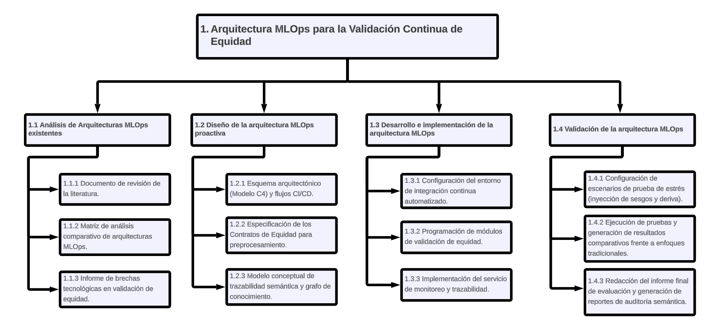

<!-- Fuente: 20202117_SergioChumbimuni_LuisVives_E2.pdf, pp. 88–100. Transcripción del PDF con correcciones editoriales y rediseño del producto (ver capitulos/CAMBIOS.md); ver capitulos/README.md -->

# Anexo A: Formulario de Extracción

[Formulario de Extracción](https://docs.google.com/spreadsheets/d/1JN1V4FIywM8CCUYy8dCghtPRuExf2mWbP-lAPMFrSJQ/edit?gid=0#gid=0)

> **Nota de transcripción:** en el PDF el Anexo A es solo un hipervínculo a una hoja de Google Sheets; el contenido del formulario no está en el PDF.

# Anexo B: Plan de Proyecto

- **Justificación**

En la actualidad, los algoritmos de aprendizaje automático (*Machine Learning*) han transformado la toma de decisiones en sectores críticos como la atención médica, las finanzas y la justicia; sin embargo, han evidenciado el riesgo crítico de exacerbar y perpetuar sesgos sociales e históricos (Vasquez et al., 2024). A medida que estos sistemas se implementan a gran escala, el sesgo algorítmico puede propagarse sistemáticamente a lo largo de las distintas etapas de la canalización de desarrollo, ocasionando impactos perjudiciales y discriminatorios sobre subgrupos de individuos, especialmente minorías, si no existen controles adecuados desde las etapas tempranas (Biswas & Rajan, 2021). Frente a la necesidad de llevar estos modelos a producción, la industria ha adoptado el paradigma de MLOps (*Machine Learning Operations*). Si bien esta práctica automatiza el despliegue de software, los enfoques tradicionales adolecen de mecanismos de gobernanza efectivos y suelen evaluar la equidad (*fairness*) de forma estática al final del proceso, tratando al modelo como una "caja negra" (Stoyanovich et al., 2022). Esta evaluación tardía es ineficiente porque ignora la naturaleza composicional del sesgo; es decir, la posibilidad de que la discriminación sea inyectada silenciosamente por operaciones intermedias, como el escalado o la imputación de datos durante la etapa de preprocesamiento (Biswas & Rajan, 2021). Esta brecha técnica se ha convertido hoy en un estricto imperativo regulatorio. Marcos legales modernos, como el Reglamento (UE) 2024/1689 (Ley de IA de la Unión Europea), exigen que los sistemas de alto riesgo mitiguen los posibles sesgos y cuenten con un nivel adecuado de precisión, transparencia y supervisión humana para proteger los derechos fundamentales (Parlamento Europeo y Consejo de la Unión Europea, 2024). En el ámbito peruano, el Decreto Supremo N° 115-2025-PCM establece explícitamente que el desarrollo y uso de sistemas basados en IA deben garantizar la no discriminación y la rendición de cuentas, exigiendo a los implementadores mantener un registro actualizado y accesible sobre las fuentes de datos y la lógica del algoritmo para facilitar su auditoría (Presidencia del Consejo de Ministros, 2025). En consecuencia, la presente investigación se justifica en la necesidad imperativa de diseñar e implementar una arquitectura MLOps que valide la equidad de manera continua a través de compuertas de calidad (*QA Gates*) preventivas. Al integrar controles modulares basados en "Contratos de Equidad", junto con mecanismos de trazabilidad semántica que emplean Grafos de Conocimiento para documentar el linaje de los modelos y las decisiones algorítmicas (Russo & Vidal, 2025), este proyecto aporta un valor práctico, técnico y metodológico invaluable. Su desarrollo permitirá a las organizaciones superar las deficiencias del monitoreo tradicional y cumplir con las normativas vigentes, asegurando que la Inteligencia Artificial desplegada en la sociedad sea ética, auditable y segura por diseño.

- **Viabilidad**

La viabilidad del proyecto se sustenta en la disponibilidad de recursos técnicos, el acceso a fuentes de información estandarizadas y la capacidad metodológica y humana para desarrollar la arquitectura MLOps dentro del tiempo establecido.

**Viabilidad técnica**

El desarrollo y la automatización de la arquitectura propuesta no dependen de supercomputadoras inaccesibles, ya que el *pipeline* se ejecuta en una estación de trabajo personal y en los ejecutores de integración continua, con herramientas de código abierto. Se utilizará GitHub Actions sobre un repositorio privado para orquestar la canalización y ejecutar las pruebas de Pytest generadas por el motor de contratos; el mismo conjunto de pruebas puede ejecutarse localmente. La trazabilidad semántica se implementará con herramientas *open-source* (RDFLib, pySHACL y Oxigraph), garantizando que no existan barreras de licencias comerciales para completar el desarrollo.

**Viabilidad respecto al acceso al conjunto de datos**

El proyecto emplea dos conjuntos de datos. El caso principal es el conjunto "Credit-scoring data" publicado en Kaggle, de scoring crediticio y reportado como proveniente de una fintech de Asia Central, con datos ya codificados numéricamente y sin identificadores personales (Davronov, 2021; Giang Thi Thu et al., 2024). Su licencia reserva los derechos a sus autores, por lo que se utiliza con fines exclusivamente académicos, sin redistribuirlo: los repositorios del proyecto son privados. El caso secundario son los datos públicos del registro de solicitudes hipotecarias de Estados Unidos (HMDA), de libre acceso (FFIEC, s.f.). Ninguno de los dos requiere la aprobación de comités externos para su uso en investigación.

**Viabilidad metodológica y humana**

La viabilidad metodológica y humana está garantizada. El tesista cuenta con la formación en ingeniería informática necesaria para instrumentar canalizaciones de integración continua, programar pruebas de software y articular el ciclo de vida del aprendizaje automático. Además, este trabajo cuenta con la supervisión y validación técnica del Mg. Luis Vives, docente e investigador con amplia experiencia, lo que asegura el rigor metodológico durante las fases de diseño y validación experimental de la tesis.

**Viabilidad institucional y alcance**

Los productos entregables del proyecto son alcanzables dentro del cronograma académico debido a que la validación operativa está claramente delimitada. El sistema será validado mediante pruebas de estrés (*stress-testing*) inyectando derivas y sesgos sintéticos en un entorno de simulación controlado (*staging*), lo que permitirá comprobar la capacidad de interrupción de las compuertas de calidad sin la necesidad de desplegar e integrar la arquitectura en la infraestructura de una empresa o cliente real.

- **Alcance**

La presente investigación se enfoca en el diseño, implementación y validación experimental de una arquitectura MLOps de Nivel 2 orientada a la validación continua de equidad (*fairness*) en algoritmos de aprendizaje supervisado. El proyecto abarcará la construcción de una canalización integral que operará sobre conjuntos de datos tabulares. El desarrollo del sistema incluye:

- La configuración de un entorno de Integración y Entrega Continua (CI/CD) automatizado.
- La programación de un motor de contratos y de "Contratos de Equidad" modulares que actuarán como compuertas de calidad (*QA Gates*) con capacidad de interrupción sobre los datos crudos, cada transformador de preprocesamiento, el modelo entrenado (con remediación) y los lotes de producción.
- La integración de un módulo de trazabilidad semántica mediante Grafos de Conocimiento (empleando MLflow como canal de linaje, RDFLib, los vocabularios PROV-O y DQV y validación SHACL) para documentar el linaje de los datos, los modelos y las métricas de sesgo.
- La validación de la efectividad de la arquitectura mediante pruebas de estrés (*stress-testing*), que consistirán en inyectar intencionalmente subrepresentación, sesgos por proxy, sesgos en las etiquetas y derivas de datos (*data drift*) sobre el conjunto de datos principal, más un escenario de control sin inyección, y en evaluar la deriva real entre años en el conjunto de datos secundario, en un entorno de simulación (*staging*).

- **Limitaciones**

El desarrollo, la implementación y la validación del proyecto están sujetos a las siguientes restricciones tecnológicas y operativas:

- **Tipología de datos y algoritmos:** La arquitectura propuesta, así como las métricas matemáticas empleadas en los Contratos de Equidad, se diseñarán y validarán exclusivamente para modelos de aprendizaje supervisado aplicados a conjuntos de datos estructurados (tabulares). El alcance no cubre el procesamiento de datos no estructurados, como visión artificial, procesamiento de audio o lenguaje natural (texto libre).
- **Entorno de despliegue operativo:** Los resultados del estudio son de carácter experimental y académico. La evaluación de la arquitectura se realizará en un entorno de simulación controlado (*staging*). El sistema no será implementado, integrado ni operado en la infraestructura de producción real de una entidad gubernamental o privada.
- **Procedencia y licencia de los datos:** El conjunto de datos principal carece de diccionario de columnas (en particular, no documenta qué grupo corresponde a cada valor del atributo sexo) y su licencia no permite redistribuirlo. Por ello, las métricas sobre ese atributo se calculan de forma simétrica y el conjunto de datos no se publica junto con el código.
- **Restricciones de capacidad computacional:** La instrumentación de la trazabilidad semántica (Zona 4 de la arquitectura) y la generación iterativa de Grafos de Conocimiento exigen una carga significativa de procesamiento y consumo de memoria RAM. Esta exigencia de hardware podría limitar el volumen máximo de los conjuntos de datos que se podrán procesar simultáneamente durante las pruebas de estrés locales, acotando los escenarios de simulación a los recursos computacionales disponibles por el tesista.

- **Identificación de los riesgos del proyecto**

Durante la planificación del proyecto se identificaron los principales riesgos que podrían afectar su desarrollo, considerando aspectos técnicos, de gestión y de disponibilidad de recursos. En la siguiente tabla se describen los riesgos potenciales, sus síntomas, nivel de probabilidad, impacto y severidad, así como las estrategias de mitigación y contingencia propuestas para reducir sus efectos.

La severidad (S) se calcula como el producto entre la probabilidad (P) y el impacto (I). Los niveles se clasifican en una escala de Muy Bajo (1) a Muy Alto (5).

| Descripción | Síntomas | Probabilidad (P) | Impacto (I) | Severidad (S) | Mitigación | Contingencia |
|---|---|---|---|---|---|---|
| Incompatibilidad de versiones entre bibliotecas de MLOps y Trazabilidad | Errores de ejecución en la canalización al integrar módulos como MLflow, Fairlearn, Evidently y RDFLib en un mismo flujo. | 3 | 4 | 12 | Uso de entornos virtuales e imágenes de contenedores Docker con versiones de bibliotecas estables y fijadas (*pinned requirements*). | Aislar temporalmente el componente defectuoso del pipeline CI/CD o buscar bibliotecas *open-source* equivalentes para la validación. |
| Sobrecarga computacional al generar el Grafo de Conocimiento | Mensajes de error por falta de memoria (RAM) o tiempos de ejecución excesivamente largos al transformar metadatos a formato RDF o al calcular intervalos *bootstrap*. | 3 | 4 | 12 | Limitar el volumen de los datos, la cantidad de metadatos a trazar y el número de remuestreos *bootstrap*. | Migrar la carga de generación semántica temporalmente a un entorno en la nube (ej. Google Colab) o simplificar la ontología de sesgos. |
| Falta de convergencia de modelos sesgados en las pruebas de estrés | Los modelos no logran entrenarse correctamente o las métricas de equidad son inconsistentes tras inyectar el sesgo sintético (*bias drift*). | 2 | 4 | 8 | Usar conjuntos de datos empleados en la literatura de equidad en scoring crediticio (Davronov y HMDA) y fijar semillas aleatorias para la reproducibilidad. | Ajustar los niveles de inyección sintética de sesgos o utilizar algoritmos predictivos base menos complejos (ej. Regresión Logística). |
| Limitaciones en conocimientos técnicos sobre Web Semántica | Retrasos en el desarrollo de la Zona 4 de la arquitectura, errores al diseñar la ontología o fallos al formular consultas SPARQL. | 3 | 3 | 9 | Fortalecer la capacitación revisando la documentación oficial de RDFLib, PROV-O, DQV y SHACL; mantener comunicación continua con el asesor. | Emplear consultas SPARQL genéricas predefinidas en la literatura para extraer únicamente el linaje de datos más elemental. |
| Retrasos en el cronograma de trabajo del proyecto | Atraso en entregables, acumulación de tareas de programación de las *QA Gates* o demoras en las revisiones con el asesor | 3 | 3 | 9 | Elaborar un cronograma semanal con hitos verificables y establecer reuniones planificadas con el asesor | Reajustar prioridades y simplificar experimentos no críticos para cumplir con la validación de la arquitectura central. |
| Restricciones de licencia o de documentación del conjunto de datos | El conjunto de datos no permite su redistribución o carece de información sobre la codificación de sus atributos protegidos. | 3 | 3 | 9 | Mantener privados los repositorios de código y datos, documentar el procedimiento de obtención y usar métricas simétricas cuando no se conozca el grupo no privilegiado. | Trasladar la evaluación principal al conjunto de datos público secundario (HMDA). |

**Tabla 15. Riesgos Identificados**

- **Estructura de descomposición del trabajo (EDT)**

Para la planificación y ejecución ordenada del proyecto, se ha desarrollado una Estructura de Descomposición del Trabajo (EDT) que divide la investigación en paquetes de trabajo manejables. El primer nivel representa el proyecto en su totalidad, el segundo nivel corresponde a los cuatro objetivos específicos y el tercer nivel detalla los resultados esperados (entregables) de cada fase:

**Figura 10: Estructura de descomposición del trabajo**

- **Lista de tareas**

| Tarea | Duración (días) | Esfuerzo (horas) | Costo (S/.) |
|---|---|---|---|
| 1. Análisis del Estado del Arte y Brechas | 20 | 40 | 2000 |
| 1.1. Ejecutar revisión sistemática y filtrado de estudios | 13 | 26 | 1300 |
| 1.2. Elaborar matriz comparativa de automatización y trazabilidad | 5 | 10 | 500 |
| 1.3. Redactar el informe de brechas tecnológicas | 2 | 4 | 200 |
| 2. Diseño de la Arquitectura MLOps | 30 | 60 | 3000 |
| 2.1. Elaborar el modelo C4 y definir el flujo del pipeline CI/CD | 14 | 28 | 1400 |
| 2.2. Diseñar y formular matemáticamente los Contratos de Equidad | 6 | 12 | 600 |
| 2.3. Modelar la ontología y esquema del Grafo de Conocimiento | 10 | 20 | 1000 |
| 3. Desarrollo e Implementación | 50 | 100 | 5000 |
| 3.1. Configurar CI/CD (GitHub Actions) y versionado de datos (DVC) | 10 | 20 | 1000 |
| 3.2. Programar el motor de contratos y las QA Gates (Pytest, Fairlearn) | 25 | 50 | 2500 |
| 3.3. Integrar MLflow, el exportador RDF y la validación SHACL | 15 | 30 | 1500 |
| 4. Validación y Evaluación del Sistema | 25 | 50 | 2500 |
| 4.1. Configurar entorno staging e inyectar sesgos sintéticos | 10 | 20 | 1000 |
| 4.2. Ejecutar validación comparativa y extraer métricas de equidad | 10 | 20 | 1000 |
| 4.3. Extraer reportes (SPARQL) y redactar informe final de viabilidad | 5 | 10 | 500 |
| **TOTAL ESTIMADO** | **125 días** | **250 horas** | **S/. 12500** |

**Tabla 16: Lista de Tareas**

- **Cronograma del proyecto**

Con base en la lista de tareas, se elaboró un cronograma de trabajo secuencial para los 109 días de ejecución previstos (aproximadamente 16 semanas de dedicación asumiendo 2 horas diarias). Este cronograma detalla el flujo de actividades y sus dependencias, asegurando que la validación y evaluación solo se ejecuten cuando la arquitectura haya sido íntegramente desarrollada:

[Cronograma_Detallado_20202117_SergioChumbimuni](https://docs.google.com/spreadsheets/d/1chlP4i1XpWwto6bSq2iiW84iaOECVYVULAyoz7jm4_A/edit?usp=sharing)

- **Lista de recursos**

Para la correcta ejecución del proyecto se ha identificado el recurso humano, los equipos de cómputo y el *stack* tecnológico especializado (orientado al *Machine Learning* y a la Web Semántica) que se empleará durante todo el ciclo de desarrollo.

a) **Personas involucradas:**
- **Tesista:** Responsable del diseño, programación, implementación de la arquitectura MLOps, instrumentación de la trazabilidad y redacción del informe.
- **Asesor:** El Mg. Luis Vives Garnique, quien brinda supervisión metodológica y validación técnica en el despliegue de las integraciones de ingeniería de software.

b) **Materiales requeridos:**
- **Internet:** Necesario para ejecutar la integración continua en GitHub Actions, sincronizar el almacenamiento remoto privado de DVC y descargar los conjuntos de datos.
- **Energía eléctrica:** Para la operación continua del entorno de desarrollo.

c) **Equipamiento:**
- **Laptop personal:** Equipo de alto rendimiento capaz de ejecutar modelos de aprendizaje automático y virtualizar servicios, necesario para el prototipado inicial, procesamiento de datos y validación de las compuertas de calidad.

d) **Herramientas requeridas (Software):**
- **Lenguaje de programación:** Python.
- **Desarrollo y automatización:** Pandas y scikit-learn (preprocesamiento y entrenamiento), GitHub Actions (orquestador de CI/CD), DVC (versionado de datos), MLflow (monitoreo y registro de modelos), y Pytest (evaluación de los Contratos de Equidad en tiempo de compilación).
- **Equidad Algorítmica:** Fairlearn para calcular disparidades estadísticas y aplicar la remediación; Evidently para el monitoreo de deriva; y SHAP para generar las razones de rechazo.
- **Trazabilidad Semántica:** RDFLib (procesamiento de grafos en Python), vocabularios PROV-O y DQV, pySHACL (validación SHACL), Oxigraph (repositorio RDF local; GraphDB opcional) y SPARQL (lenguaje de consultas).

- **Costeo del Proyecto**

Se realizó una estimación económica del proyecto integrando el tiempo de dedicación del tesista (250 horas calculadas a una base de S/. 50.00 por hora), así como los costos proporcionales de servicios y equipamiento. Al emplearse una arquitectura fundamentada exclusivamente en herramientas de código abierto (*open-source*), los costos por licencias de software son nulos.

| Ítem | Descripción | Unidad | Cantidad | Valor Unidad (S/.) | Monto Total (S/.) |
|---|---|---|---|---|---|
| **0** | **Costo total del proyecto** | --- | --- | --- | **14,725** |
| **1.** | **Estudiantes o tesistas** | --- | --- | --- | **12,500** |
| 1.1 | Sergio Alonso Chumbimuni Bustamante | Horas | 250 | 50 | 12,500 |
| **2.** | **Otros participantes** | --- | --- | --- | **0** |
| 2.1 | Asesor (Mg. Luis Vives Garnique) | --- | --- | --- | 0 (*) |
| **3.** | **Servicios e infraestructura** | --- | --- | --- | **600** |
| 3.1 | Internet y electricidad (proporcional al tiempo) | Mes | 4 | 150 | 600 |
| **4.** | **Bienes y equipos** | --- | --- | --- | **625** |
| 4.1 | Equipo de cómputo (costo referencial) | Horas | 250 | 2.50 | 625 |
| 4.2 | Licencias de Software (*Stack open-source*) | Unidad | 1 | 0 | 0 |

**Tabla 17: Costos del Proyecto**

(*): Este costo operativo es asumido por la universidad.
