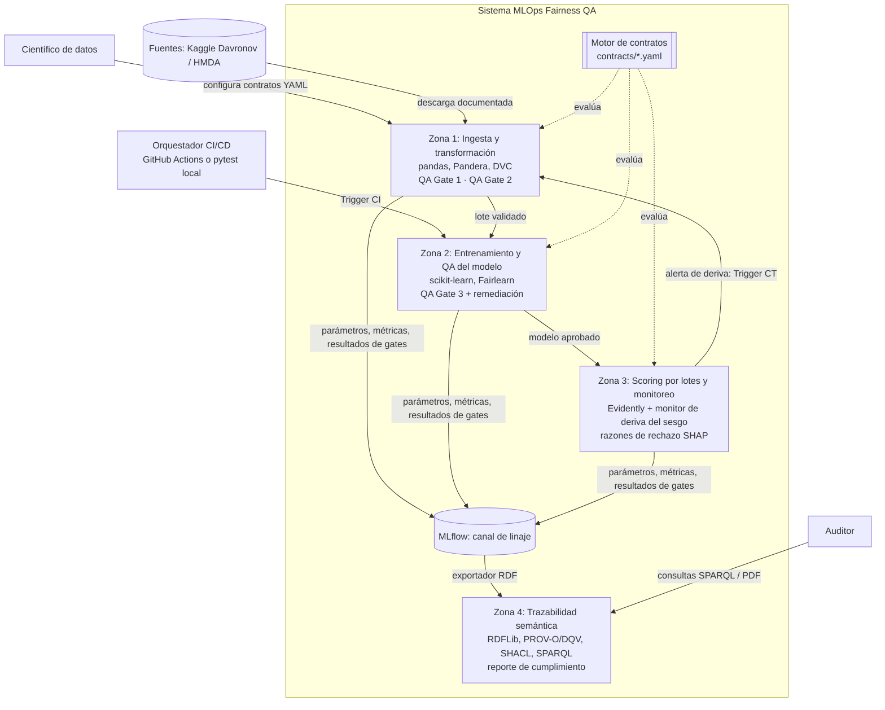

# Propuesta de rediseño del producto: Sistema MLOps Fairness QA

- **Fecha:** 2026-09-25
- **Estado:** **aprobada por el autor el 2026-09-25** y aplicada a los capítulos (ver `capitulos/CAMBIOS.md`, sección 5). El código aún no se ha modificado.
- **Insumos:** `estado/implementacion-vs-tesis.md` (contraste código vs. tesis y ficha del dataset), `capitulos/04-diseno.md`, `bibliografia/index.md` y el código en `Tesis/Proyecto/mlops-fairness-scoring` (commit `f3977fa`).
- **Idea central:** menos piezas, pero cada una **medible y defendible**. Se mantienen las 4 Zonas, los contratos C1–C3 con sus umbrales y la trazabilidad semántica. Cambia la forma de implementarlos.

---

## 1. Qué se mantiene y qué cambia

| Se mantiene | Cambia |
|---|---|
| 4 Zonas (datos, CI/entrenamiento, CD/monitoreo, trazabilidad) | "100% local sin internet" → **reproducible local y en CI** |
| QA Gates 1, 2 y 3 con contratos C1, C2 y C3 en YAML | Un **esquema único de contrato** y un **motor genérico** que lo evalúa (hoy cada contrato tiene estructura y test propios) |
| Umbrales: representatividad ≥ 0,05; MI condicional ≤ 0,10; \|SPD\| y \|EOD\| ≤ 0,10; DI ≥ 0,80 | C2 pasa a evaluar **cada transformador antes y después**; C3 incorpora **remediación explícita** y **bootstrap** |
| Davronov como caso de estudio principal | Se agrega **HMDA** como segundo dataset (deriva real, generalización) y `Age_group` como segundo atributo protegido |
| Trazabilidad RDF/OWL con SPARQL | Se quita **InterpretME**: el grafo se construye con **RDFLib** a partir de MLflow; GraphDB queda opcional |
| SHAP | Deja de ser un paso del CI y pasa a ser un **generador de razones de rechazo** (ECOA §1691(d), art. 25 del D.S. 115-2025-PCM) |

---

## 2. Datos

### 2.1 Davronov (caso principal)

| Aspecto | Decisión |
|---|---|
| **Archivos** | Usar `data_train.csv` (8 707 filas, el actual) e incorporar `data_test.csv` (≈48 filas etiquetadas) como lote adicional. Total 8 755, coherente con Giang Thi Thu et al. (2024). |
| **Licencia** | "Data files © Original Authors" (no es abierta). **Poner los repositorios de GitHub y DagsHub en privado**, sacar el CSV del historial de Git público y documentar en el README cómo descargarlo de Kaggle. Declarar la licencia en las limitaciones de la tesis. |
| **Procedencia** | Redactar como "dataset de scoring crediticio reportado como proveniente de una fintech de Asia Central (Giang Thi Thu et al., 2024)". La página de Kaggle no menciona la fintech. |
| **Etiqueta** | `label=1` = buen pagador (92,3%); `label=0` = default (7,7%). Coincide con la tesis. |
| **Fuga de la variable objetivo** | `Score_level`, `Score_class` y `Score_point` se excluyen **declarándolo en el contrato C1**, no solo en el ingestor. El notebook del autor, que las usa, llega a ≈100% de exactitud, lo que evidencia la fuga. |
| **Atributo protegido 1: `Sex`** | Valores {1, 2}, **codificación no documentada**. Se trata como "Grupo 1" y "Grupo 2", sin asumir cuál es el no privilegiado. Métricas **simétricas**. Brecha en la etiqueta real: 94,1% vs. 91,2% (≈2,9 pp). |
| **Atributo protegido 2: `Age_group`** (nuevo) | Corte en `<25` / `≥25`. Proporciones: 7,5% / 92,5% (ambos ≥ 5%, cumplen el C1). Brecha en la etiqueta real: **84,0% vs. 93,0% (≈9 pp)**, mayor que la de sexo. Aquí el grupo no privilegiado es observable en los datos (`<25`). La edad es un atributo protegido por la ECOA. Un corte en `≥60` no sirve, porque ese grupo solo tiene el 4,1% y fallaría el C1. |
| **Proxy conocido** | `Marital` (casi perfectamente asociado a `Sex`). Se mantiene como caso documentado del C2 y como escenario de regresión: si alguien lo reintroduce, el C2 debe fallar. |

### 2.2 HMDA (segundo dataset, nuevo)

| Aspecto | Decisión |
|---|---|
| **Fuente** | Datos públicos del LAR de HMDA (FFIEC/CFPB), 2018 en adelante. Dominio público de EE. UU.: se puede versionar sin problemas de licencia. |
| **Recorte** | Un estado y **dos años** (por ejemplo, uno previo y uno posterior a un cambio de tasas) y, si es posible, solo prestamistas fintech filtrando por `lei`. La lista de prestamistas fintech **debe tomarse de la literatura**; aún no está verificada. |
| **Etiqueta** | `action_taken`: originado/aprobado vs. denegado. Es la **decisión del prestamista**, no el pago; hay que declararlo. |
| **Atributos protegidos** | `derived_sex`, `derived_race`, `derived_ethnicity` y `applicant_age` (por rangos), autodeclarados y documentados. |
| **Proxy para el C2** | `tract_minority_population_percent` (composición del vecindario). Es el proxy clásico de la doctrina de impacto dispar. |
| **Usos** | (1) **Deriva real entre años** para la Zona 3 y O4. (2) Demostrar que la arquitectura **no depende del dataset**: mismos contratos, otro YAML. (3) `denial_reason-1..4` sirve como referencia para validar las razones de rechazo generadas. |

---

## 3. Arquitectura (C4 nivel 2, revisada)



**Principios:**
- **Un solo motor de contratos** evalúa los gates de las tres Zonas.
- **MLflow es el único canal de linaje:** la Zona 4 no lee nada fuera de MLflow.
- **Ejecución idéntica local y en CI:** el mismo `pytest`, en Windows (desarrollo) y en `ubuntu-latest` (GitHub Actions).
- **Confidencialidad por datos, no por red:** repositorios privados y atributo protegido seudonimizado en la Zona 3.

---

## 4. Motor de contratos

### 4.1 Esquema único (implementa la Tabla 11 de la tesis)

```yaml
contract_id: C3
version: "2.0"
gate: QA_GATE_3
stage: modelo_entrenado
dataset: davronov
protected_attributes:
  - {name: Sex, groups: [1, 2], unprivileged: null}      # codificación desconocida → métricas simétricas
  - {name: Age_group, groups: ["<25", ">=25"], unprivileged: "<25"}
rules:
  - {id: C3-SPD, metric: spd, operator: le, threshold: 0.10, severity: block}
  - {id: C3-EOD, metric: eod, operator: le, threshold: 0.10, severity: block}
  - {id: C3-DI,  metric: di,  operator: ge, threshold: 0.80, severity: block}
  - {id: C3-ACC, metric: balanced_accuracy_drop, operator: le, threshold: 0.05, severity: warn}
statistics: {method: bootstrap, n_resamples: 500, confidence: 0.95, decide_on: worst_bound}
remediation: {enabled: true, method: threshold_optimizer, constraint: equalized_odds}
tooling: fairlearn
```

### 4.2 Comportamiento

| Pieza | Descripción |
|---|---|
| **Cargador** | Valida el YAML contra un esquema propio (pydantic o JSON Schema). Un contrato mal escrito falla antes de ejecutarse. |
| **Registro de métricas** | Cada `metric` se asocia a una función (`spd`, `eod`, `di`, `min_group_proportion`, `cmi`, `proxy_auc`, `schema_violations`, …). Agregar una métrica no requiere tocar los tests. |
| **Tests generados** | `pytest.mark.parametrize` crea **un test por (regla × atributo protegido)**. El reporte de pytest dice exactamente qué regla falló. |
| **Severidad** | `block` hace fallar el test (exit ≠ 0) y detiene el pipeline; `warn` solo registra en MLflow. |
| **DI simétrico o direccional** | Si `unprivileged` es `null`: DI = mín/máx de las tasas de selección. Si está definido: DI = tasa del grupo no privilegiado / tasa del privilegiado. Así desaparece el `di_max: 1,25` que nunca se activaba. |
| **Bootstrap** | Cada métrica se reporta con un intervalo de confianza. La decisión usa el **peor extremo** del intervalo respecto del umbral. Justificación: solo hay 670 defaults y unas 1 740 filas de prueba, así que un valor puntual es inestable. |
| **Salida estructurada** | Cada evaluación produce un registro `GateExecution` (contrato, regla, atributo, valor, IC, umbral, resultado, hash del lote, timestamp) que va a MLflow y luego a RDF. |

---

## 5. Contratos rediseñados

### C1: datos crudos (QA Gate 1, Zona 1)

| Regla | Definición | Umbral |
|---|---|---|
| Esquema | Tipos, rangos y valores permitidos (Pandera), generado desde el YAML | 0 violaciones |
| Nulos | Proporción de nulos por columna | ≤ 0,05 |
| Duplicados | Proporción de filas duplicadas | ≤ 0,01 |
| Columnas prohibidas (nuevo) | Ausencia de columnas con fuga de la variable objetivo (`Score_*`) en las variables | 0 presentes |
| Representatividad | P(Z = z) para **cada** grupo de **cada** atributo protegido | ≥ 0,05 |

### C2: transformadores (QA Gate 2, Zona 1)

Evaluación **por paso** del pipeline de preprocesamiento (imputación → escalado → codificación), comparando **antes y después** de cada paso:

| Regla | Definición | Umbral |
|---|---|---|
| Tope absoluto | Qué tan bien se predice Z a partir de las variables, condicionado a Y: **AUC** de un clasificador auxiliar dentro de cada estrato de Y, ponderado (o, alternativamente, la MI condicional por variable como ahora) | AUC ≤ 0,60 (o MI ≤ 0,10) |
| Incremento por paso | Aumento de ese indicador causado por **un solo** transformador | ≤ δ (propuesto 0,02) |
| Localización | El reporte indica **qué paso** y **qué variables** causan el aumento | — |

**Por qué el AUC:** es más fácil de interpretar y de defender que la MI k-NN tomada por variable, captura combinaciones de variables y permite reportar la importancia por variable. La MI puede conservarse como métrica secundaria. Los umbrales 0,60 y δ = 0,02 deben calibrarse en Davronov con y sin `Marital`, que es el caso positivo conocido.

### C3: modelo (QA Gate 3, Zona 2)

```
modelo base ──► evaluar C3 ──► pasa ──────────────────────► registrar y aprobar
                    │
                    └─ falla ──► remediación declarada en el YAML
                                 (ThresholdOptimizer, equalized_odds)
                                    ──► evaluar C3 sobre el modelo mitigado
                                           ├─ pasa ──► aprobar el mitigado y registrar AMBOS
                                           └─ falla ─► BLOQUEO (exit 1)
```

- **Métricas:** SPD, EOD y DI con IC bootstrap. Guardia de exactitud: pérdida de *balanced accuracy* frente al modelo base ≤ 0,05 (`warn`).
- **Se registran ambos modelos** (base y mitigado) con sus métricas de exactitud y equidad. Así se documenta el trade-off y la multiplicidad (sección 2.1.6 de la tesis).
- **CI sin `continue-on-error`:** el flujo de remediación queda dentro del gate y es explícito.

### C4: deriva en producción (nuevo, Zona 3)

| Regla | Definición | Umbral |
|---|---|---|
| Deriva de datos | Test de deriva por variable (Evidently) | Proporción de variables con deriva ≤ 0,30 (`warn`) |
| Deriva del sesgo | SPD, EOD y DI recalculados **por lote** con etiquetas retrasadas | Los mismos del C3 (`block` → Trigger CT) |

---

## 6. Zona 3: operación simulada

| Componente | Diseño |
|---|---|
| **Scorer por lotes** | Un script puntúa lotes de "producción". No hace falta un endpoint; FastAPI queda como opcional. |
| **Lotes** | Davronov: particiones del conjunto de prueba, con y sin deriva inyectada. HMDA: año 1 como referencia y año 2 como producción (**deriva real**). |
| **Captura y seudonimización** | El atributo protegido se guarda **aparte** con un identificador seudonimizado (hash con sal) y solo se usa para calcular métricas. Es la salvaguarda del Art. 10(5) del AI Act. |
| **Monitores** | Evidently (deriva de datos) y monitor propio de deriva del sesgo (C4). |
| **Trigger CT** | Una violación del C4 genera una alerta en MLflow y una marca que dispara el reentrenamiento (Zona 1). |
| **Razones de rechazo** | Para cada solicitante rechazado: las **k variables con mayor contribución negativa** (SHAP LinearExplainer sobre la regresión logística, que es barato y exacto). Se registran por solicitante, con identificador seudonimizado. En HMDA se pueden comparar con `denial_reason`. |

---

## 7. Zona 4: trazabilidad

| Pieza | Diseño |
|---|---|
| **Fuente única** | MLflow: parámetros, hash DVC del lote, versión del contrato, `GateExecution`, modelos, razones de rechazo y alertas. |
| **Exportador** | Script con RDFLib: de MLflow a Turtle. Se ejecuta al final del pipeline. |
| **Ontología mínima** | Reutiliza **PROV-O** (`prov:Activity`, `prov:Entity`, `prov:used`, `prov:wasGeneratedBy`) y **DQV** (`dqv:QualityMeasurement`, `dqv:isMeasurementOf`, `dqv:value`). Solo se definen las clases propias: `fair:FairnessContract`, `fair:Rule`, `fair:GateExecution`, `fair:ProtectedAttribute`, `fair:ModelVersion`, `fair:AdverseActionReason`. |
| **Validación** | Formas **SHACL**: toda `GateExecution` tiene contrato, regla, valor, umbral, resultado y lote. Esto resuelve las propiedades que la tesis usa sin definir. |
| **Almacén** | RDFLib en memoria u Oxigraph (sin servidor). GraphDB Free queda **opcional** para la demo visual. |
| **Preguntas de competencia** | 4 o 5 consultas SPARQL fijas, por ejemplo: (1) ¿qué contrato y regla bloquearon el modelo X, y con qué valor e IC? (2) ¿Con qué lote (hash) se entrenó el modelo aprobado? (3) ¿Qué razones se dieron al solicitante Y? (4) ¿Qué alertas de deriva del sesgo hubo en el periodo P? (5) ¿Cuál fue el trade-off entre el modelo base y el mitigado? |
| **Reporte** | Un PDF (Jinja2 y WeasyPrint, o Markdown y Pandoc) generado **solo** con los resultados de esas consultas. |

---

## 8. Evaluación experimental (O4)

- **Comparación:** "Nivel 0", una única auditoría del modelo final (C3 aplicado solo al final, sin C1, C2, C4 ni localización), contra la arquitectura propuesta.
- **Escenarios**, inyectados sobre Davronov (en la línea de Zhu et al., 2025), más la deriva real de HMDA:

| # | Escenario | Qué se inyecta | Gate que debería detectarlo |
|---|---|---|---|
| E0 | Control negativo | Nada | Ninguno (mide **falsos positivos**) |
| E1 | Subrepresentación | Submuestreo de un grupo por debajo del 5% | C1 |
| E2 | Proxy reintroducido | Volver a incluir `Marital` | C2 (paso de codificación) |
| E3 | Transformador sesgado | Imputación distinta por grupo | C2 (paso de imputación) |
| E4 | Sesgo en etiquetas | Invertir el X% de las etiquetas de un grupo | C3 |
| E5 | Deriva simulada | Desplazamiento de distribución por grupo en los lotes | C4 |
| E6 | Deriva real | HMDA año 1 → año 2 | C4 |

- **Métricas de O4:**
  - tasa de detección por escenario;
  - **exactitud de localización** (¿se señaló el gate y el paso correctos?);
  - etapa de detección (datos, transformación, modelo o producción);
  - tiempo hasta el bloqueo;
  - tasa de falsos positivos (E0), con varias semillas.
- **Resultado esperado:** Nivel 0 solo detecta al final y no localiza; en E1–E3 no puede decir dónde nació el sesgo. Esa diferencia es la **contribución demostrable** de la tesis y cubre los indicadores de R.E.4.1 y R.E.4.2.

---

## 9. Stack final

| Capa | Herramienta | Estado |
|---|---|---|
| Datos y versionado | pandas, Pandera, DVC (remoto **privado**) | Se mantiene |
| Modelo y equidad | scikit-learn, **Fairlearn** | Se mantiene (AIF360 se elimina si no se usa) |
| Contratos | YAML con validación de esquema (pydantic), pytest parametrizado | **Nuevo** |
| CI | GitHub Actions (repo privado), mismo `pytest` en local | Se ajusta |
| Linaje | MLflow (tracking local en archivo) | Por implementar |
| Monitoreo | Evidently y monitor propio | Por implementar |
| Explicabilidad | SHAP (LinearExplainer) | Se reorienta |
| Semántica | RDFLib, PROV-O, DQV, pySHACL, SPARQL; Oxigraph o RDFLib en memoria | Se simplifica |
| Opcionales | GraphDB Free, FastAPI, Docker | Opcional |
| Eliminados | InterpretME | Se elimina |

**Versiones fijadas** en `requirements.txt` (o `uv.lock`/`poetry.lock`), en coherencia con la mitigación de riesgos del Anexo B y con lo aprendido del bug de DVC 3.67.1.

---

## 10. Estructura de repositorio propuesta

```
mlops-fairness-scoring/
├── contracts/            # c1.yaml, c2.yaml, c3.yaml, c4.yaml, schema.json
├── fairqa/               # motor de contratos (paquete)
│   ├── contracts.py      # carga y validación de YAML
│   ├── metrics.py        # registro de métricas (spd, eod, di, cmi, proxy_auc…)
│   ├── bootstrap.py
│   └── lineage.py        # registro de GateExecution en MLflow
├── zona1_ingesta/        # ingestor, transformadores por paso
├── zona2_training/       # entrenamiento y remediación
├── zona3_monitoring/     # scorer por lotes, monitor de deriva, razones de rechazo
├── zona4_semantica/      # ontología .ttl, shapes SHACL, exportador, consultas .rq, reporte
├── experiments/          # escenarios E0–E6 y script de evaluación O4
├── tests/                # tests generados desde contratos y tests unitarios del motor
└── .github/workflows/ci.yml
```

---

## 11. Prioridades

| Prioridad | Entregable | Cubre |
|---|---|---|
| **Imprescindible** | Motor de contratos y C1–C3 rediseñados (con remediación y bootstrap) | R.E.3.1, R.E.3.2 |
| **Imprescindible** | Registro en MLflow, exportador RDF, SHACL y 4–5 consultas SPARQL con reporte | R.E.3.3, R.E.4.3 |
| **Imprescindible** | Escenarios E0–E5 y comparación con Nivel 0 | R.E.4.1, R.E.4.2 |
| **Deseable** | C4 y monitor de deriva; razones de rechazo | R.E.3.3 |
| **Deseable** | HMDA (E6 y generalización) | R.E.4.1 |
| **Opcional** | GraphDB, FastAPI, Docker | — |

---

## 12. Impacto en la tesis (cuando se apruebe)

| Capítulo | Cambios |
|---|---|
| 1 | R.E.2.1 a R.E.4.3: ajustar los indicadores a lo medible (localización, falsos positivos). Herramientas: quitar InterpretME y agregar Oxigraph/pySHACL. Fase 4 sin InterpretME. |
| 2 | Añadir equidad con incertidumbre estadística (bootstrap) como justificación metodológica. Declarar Age como atributo protegido (ECOA). |
| 4 | Reescribir el C4 nivel 2 y 3, la Tabla 11 (nuevo esquema), las fórmulas del C2 (por paso), el C3 (remediación y DI simétrico/direccional), el C4 nuevo, la ontología (PROV-O/DQV/SHACL), el ejemplo Turtle con Davronov (8 707 filas, hash `1aa87791…`) y la restricción 4.2.2. |
| 5 | Redactar a partir de la implementación nueva (DVC privado, motor, gates y hallazgo de `Marital`). |
| Anexo B | Actualizar el stack, los riesgos (licencia del dataset) y la lista de tareas. |

---

## 13. Decisiones pendientes del autor

1. ¿Aprobar el cambio de stack: quitar InterpretME y dejar GraphDB opcional?
2. ¿Agregar `Age_group` (<25 / ≥25) como segundo atributo protegido?
3. ¿Remediación automática en el C3, o solo bloqueo y mitigación manual documentada?
4. ¿Agregar HMDA como segundo dataset? ¿Qué estado y qué años?
5. ¿Usar el AUC del clasificador auxiliar en el C2 en lugar de la MI por variable? (Con calibración previa de los umbrales 0,60 y δ = 0,02.)
6. Poner en privado los repositorios de GitHub y DagsHub y **limpiar el CSV del historial público**. Solo hacerlo privado deja el historial accesible a quien ya lo clonó; una reescritura del historial (`git filter-repo`) es una acción destructiva y conviene hacerla con respaldo.

**ADRs a escribir tras la aprobación:** (1) dataset principal y secundario; (2) motor de contratos genérico; (3) remediación en el C3; (4) C2 por paso con AUC; (5) eliminar InterpretME; (6) bootstrap en los gates; (7) repositorios privados por licencia.
